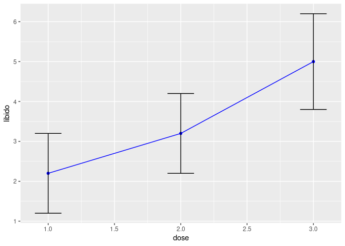
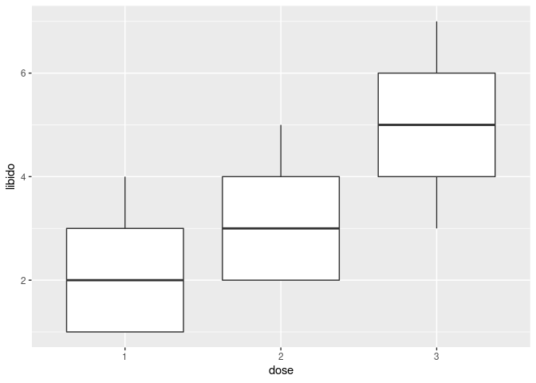
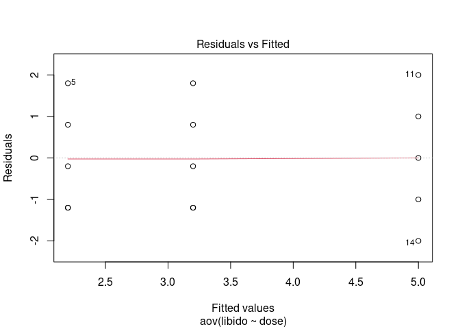
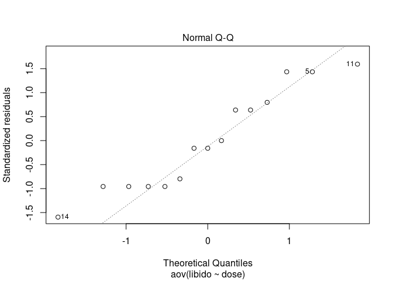
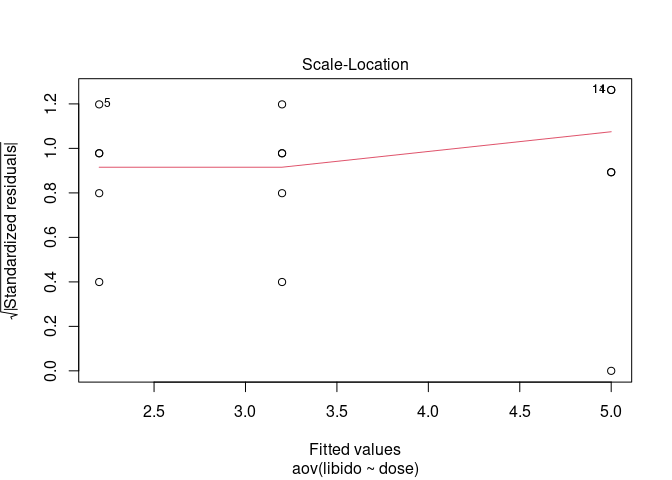
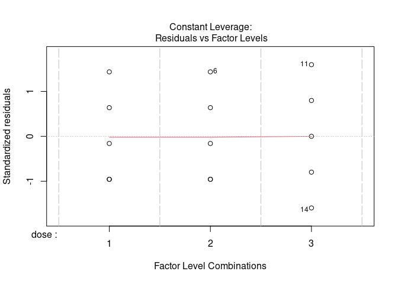

Anova
================

## Code for anova , robust+non-robust

### Importing Packages

``` r
library(ggplot2) # for graphs
library(WRS) # for robust stats
```

    ## Loading required package: MASS

    ## Loading required package: akima

    ## Loading required package: robustbase

    ## 
    ## Attaching package: 'WRS'

    ## The following object is masked from 'package:robustbase':
    ## 
    ##     hard.rejection

    ## The following object is masked from 'package:MASS':
    ## 
    ##     ltsreg

    ## The following object is masked from 'package:stats':
    ## 
    ##     ecdf

    ## The following object is masked from 'package:grDevices':
    ## 
    ##     bmp

``` r
library(car) # for levene tese
```

    ## Loading required package: carData

    ## 
    ## Attaching package: 'car'

    ## The following object is masked from 'package:WRS':
    ## 
    ##     ellipse

``` r
library(multcomp) # for posthoc test
```

    ## Loading required package: mvtnorm

    ## Loading required package: survival

    ## 
    ## Attaching package: 'survival'

    ## The following object is masked from 'package:robustbase':
    ## 
    ##     heart

    ## Loading required package: TH.data

    ## 
    ## Attaching package: 'TH.data'

    ## The following object is masked from 'package:MASS':
    ## 
    ##     geyser

``` r
library(compute.es) # for effect sizes
library(pastecs) # for descriptive stats
library(dplyr)
```

    ## 
    ## Attaching package: 'dplyr'

    ## The following objects are masked from 'package:pastecs':
    ## 
    ##     first, last

    ## The following object is masked from 'package:car':
    ## 
    ##     recode

    ## The following objects are masked from 'package:WRS':
    ## 
    ##     near, pull

    ## The following object is masked from 'package:MASS':
    ## 
    ##     select

    ## The following objects are masked from 'package:stats':
    ## 
    ##     filter, lag

    ## The following objects are masked from 'package:base':
    ## 
    ##     intersect, setdiff, setequal, union

``` r
library(reshape2)
```

``` r
df<- read.delim('/home/atrides/Desktop/R/statistics_with_R/10_GLM1_ANOVA/Data_Files/Dummy.dat', header=TRUE)

m01<- lm(libido~dummy1+dummy2, data=df)
summary(m01)
```

    ## 
    ## Call:
    ## lm(formula = libido ~ dummy1 + dummy2, data = df)
    ## 
    ## Residuals:
    ##    Min     1Q Median     3Q    Max 
    ##   -2.0   -1.2   -0.2    0.9    2.0 
    ## 
    ## Coefficients:
    ##             Estimate Std. Error t value Pr(>|t|)   
    ## (Intercept)   2.2000     0.6272   3.508  0.00432 **
    ## dummy1        2.8000     0.8869   3.157  0.00827 **
    ## dummy2        1.0000     0.8869   1.127  0.28158   
    ## ---
    ## Signif. codes:  0 '***' 0.001 '**' 0.01 '*' 0.05 '.' 0.1 ' ' 1
    ## 
    ## Residual standard error: 1.402 on 12 degrees of freedom
    ## Multiple R-squared:  0.4604, Adjusted R-squared:  0.3704 
    ## F-statistic: 5.119 on 2 and 12 DF,  p-value: 0.02469

``` r
df<- read.delim('/home/atrides/Desktop/R/statistics_with_R/10_GLM1_ANOVA/Data_Files/Viagra.dat', header=TRUE)

df
```

    ##    person dose libido
    ## 1       1    1      3
    ## 2       2    1      2
    ## 3       3    1      1
    ## 4       4    1      1
    ## 5       5    1      4
    ## 6       6    2      5
    ## 7       7    2      2
    ## 8       8    2      4
    ## 9       9    2      2
    ## 10     10    2      3
    ## 11     11    3      7
    ## 12     12    3      4
    ## 13     13    3      5
    ## 14     14    3      3
    ## 15     15    3      6

``` r
lineplot<- ggplot(df, aes(dose, libido))
lineplot<- lineplot+
  stat_summary(fun=mean,geom='point',colour='blue')+
  stat_summary(fun=mean, geom='line',colour='blue')+
  stat_summary(fun.data = mean_cl_boot,geom='errorbar', width=0.2)
lineplot
```

<!-- -->

``` r
by(df$libido, df$dose, stat.desc)
```

    ## df$dose: 1
    ##      nbr.val     nbr.null       nbr.na          min          max        range 
    ##    5.0000000    0.0000000    0.0000000    1.0000000    4.0000000    3.0000000 
    ##          sum       median         mean      SE.mean CI.mean.0.95          var 
    ##   11.0000000    2.0000000    2.2000000    0.5830952    1.6189318    1.7000000 
    ##      std.dev     coef.var 
    ##    1.3038405    0.5926548 
    ## ------------------------------------------------------------ 
    ## df$dose: 2
    ##      nbr.val     nbr.null       nbr.na          min          max        range 
    ##    5.0000000    0.0000000    0.0000000    2.0000000    5.0000000    3.0000000 
    ##          sum       median         mean      SE.mean CI.mean.0.95          var 
    ##   16.0000000    3.0000000    3.2000000    0.5830952    1.6189318    1.7000000 
    ##      std.dev     coef.var 
    ##    1.3038405    0.4074502 
    ## ------------------------------------------------------------ 
    ## df$dose: 3
    ##      nbr.val     nbr.null       nbr.na          min          max        range 
    ##    5.0000000    0.0000000    0.0000000    3.0000000    7.0000000    4.0000000 
    ##          sum       median         mean      SE.mean CI.mean.0.95          var 
    ##   25.0000000    5.0000000    5.0000000    0.7071068    1.9632432    2.5000000 
    ##      std.dev     coef.var 
    ##    1.5811388    0.3162278

``` r
print(is.factor(df$dose))
```

    ## [1] FALSE

``` r
df$dose<- as.factor(df$dose)
```

``` r
# doing levene test
leveneTest(df$libido, df$dose)
```

    ## Levene's Test for Homogeneity of Variance (center = median)
    ##       Df F value Pr(>F)
    ## group  2  0.1176   0.89
    ##       12

``` r
# since the above p value is not significant , i.e, p>.05, we can say that homogeneity of variance is maintained.
```

``` r
# also checking manually

sd(filter(df,dose==1 )$libido)
```

    ## [1] 1.30384

``` r
sd(filter(df,dose==2 )$libido)
```

    ## [1] 1.30384

``` r
sd(filter(df,dose==3 )$libido)
```

    ## [1] 1.581139

``` r
# Boxplot
box<- ggplot(df, aes(dose, libido))
box<- box+geom_boxplot()
box
```

<!-- -->

``` r
m01<- lm(libido~dose, data=df)
summary(m01)
```

    ## 
    ## Call:
    ## lm(formula = libido ~ dose, data = df)
    ## 
    ## Residuals:
    ##    Min     1Q Median     3Q    Max 
    ##   -2.0   -1.2   -0.2    0.9    2.0 
    ## 
    ## Coefficients:
    ##             Estimate Std. Error t value Pr(>|t|)   
    ## (Intercept)   2.2000     0.6272   3.508  0.00432 **
    ## dose2         1.0000     0.8869   1.127  0.28158   
    ## dose3         2.8000     0.8869   3.157  0.00827 **
    ## ---
    ## Signif. codes:  0 '***' 0.001 '**' 0.01 '*' 0.05 '.' 0.1 ' ' 1
    ## 
    ## Residual standard error: 1.402 on 12 degrees of freedom
    ## Multiple R-squared:  0.4604, Adjusted R-squared:  0.3704 
    ## F-statistic: 5.119 on 2 and 12 DF,  p-value: 0.02469

``` r
anova_table<- aov(libido~dose, data=df)
summary(anova_table)
```

    ##             Df Sum Sq Mean Sq F value Pr(>F)  
    ## dose         2  20.13  10.067   5.119 0.0247 *
    ## Residuals   12  23.60   1.967                 
    ## ---
    ## Signif. codes:  0 '***' 0.001 '**' 0.01 '*' 0.05 '.' 0.1 ' ' 1

``` r
# shows qqplot and some other plots of standarized residuals. Good for checking assumption
plot(anova_table)
```

<!-- --><!-- --><!-- --><!-- -->

``` r
# The plot we have shows points that are equally spread for the three groups, which implies that 
# variances are similar across groups (which was also the conclusion reached by Levene’s test

# from qqplot it can be seen that the assumption of normality of errors has been violated,
# so we may have to do robust anova later.
```

``` r
# Doing Welch anova in the case if homogeniety of variance  is violated(our data here dont need this test)
oneway.test(libido~dose, data=df)
```

    ## 
    ##  One-way analysis of means (not assuming equal variances)
    ## 
    ## data:  libido and dose
    ## F = 4.3205, num df = 2.0000, denom df = 7.9434, p-value = 0.05374

### Robust Anova

``` r
# first we need our data in wide format
df$id<- c(1,2,3,4,5,1,2,3,4,5,1,2,3,4,5)
df<- df[, cbind('dose','libido','id')]
df<- reshape(df, idvar = "id", timevar = "dose", direction = "wide")

names(df)<- c('id','placebo', 'low', 'high')

df<- df[, cbind('placebo', 'low', 'high')]
write.table(df, file='df_robustAnova.csv',sep=',' )
```

``` r
# now since the data is in wide format , we can use WRS package to do robust tests

# 1st robust test
t1way(df,tr=0.1)
```

    ## $TEST
    ## [1] 4.320451
    ## 
    ## $nu1
    ## [1] 2
    ## 
    ## $nu2
    ## [1] 7.943375
    ## 
    ## $n
    ## $n[[1]]
    ## [1] 5
    ## 
    ## $n[[2]]
    ## [1] 5
    ## 
    ## $n[[3]]
    ## [1] 5
    ## 
    ## 
    ## $p.value
    ## [1] 0.05373847

``` r
# 2nd robust test
med1way(df)
```

    ## [1] "NOTE: This function was modified in Dec. 2004"
    ## [1] "A new approximate critical value is used if crit=NA"
    ## [1] "This might improve type I error probabilities substantially"
    ## [1] "For discrete data with ties, this function is NOT recommended."
    ## [1] "Use the function medpb; it is best for general use"
    ## [1] "WARNING: tied values detected."
    ## [1] "Estimate of standard error might be highly inaccurate, even with n large"
    ## [1] "WARNING: tied values detected."
    ## [1] "Estimate of standard error might be highly inaccurate, even with n large"

    ## $TEST
    ## [1] 4.782879
    ## 
    ## $crit.val
    ## [1] 5.472958
    ## 
    ## $p.value
    ## [1] 0.07

``` r
# 3rd robust test
t1waybt(df)
```

    ## [1] "Taking bootstrap samples. Please wait."
    ## [1] "Working on group  1"
    ## [1] "Working on group  2"
    ## [1] "Working on group  3"
    ## [1] "Some bootstrap estimates of the test statistic could not be computed"
    ## [1] "Effective number of bootstrap samples was"
    ## [1] 394

    ## $test
    ## [1] 3
    ## 
    ## $p.value
    ## [1] 0.07360406

### all three robust test show there is no significant effect of dose on libido

## Planned Comparison

``` r
summary.lm(anova_table)
```

    ## 
    ## Call:
    ## aov(formula = libido ~ dose, data = df)
    ## 
    ## Residuals:
    ##    Min     1Q Median     3Q    Max 
    ##   -2.0   -1.2   -0.2    0.9    2.0 
    ## 
    ## Coefficients:
    ##             Estimate Std. Error t value Pr(>|t|)   
    ## (Intercept)   2.2000     0.6272   3.508  0.00432 **
    ## dose2         1.0000     0.8869   1.127  0.28158   
    ## dose3         2.8000     0.8869   3.157  0.00827 **
    ## ---
    ## Signif. codes:  0 '***' 0.001 '**' 0.01 '*' 0.05 '.' 0.1 ' ' 1
    ## 
    ## Residual standard error: 1.402 on 12 degrees of freedom
    ## Multiple R-squared:  0.4604, Adjusted R-squared:  0.3704 
    ## F-statistic: 5.119 on 2 and 12 DF,  p-value: 0.02469

``` r
df<- read.delim('/home/atrides/Desktop/R/statistics_with_R/10_GLM1_ANOVA/Data_Files/Viagra.dat', header=TRUE)
df$dose<- as.factor(df$dose)


contrast1<- c(-2, 1, 1)
contrast2<- c(0, -1, 1)
contrasts(df$dose)<- cbind(contrast1, contrast2)

aov2<- aov(libido~dose, data=df)
summary.lm(aov2)
```

    ## 
    ## Call:
    ## aov(formula = libido ~ dose, data = df)
    ## 
    ## Residuals:
    ##    Min     1Q Median     3Q    Max 
    ##   -2.0   -1.2   -0.2    0.9    2.0 
    ## 
    ## Coefficients:
    ##               Estimate Std. Error t value Pr(>|t|)    
    ## (Intercept)     3.4667     0.3621   9.574 5.72e-07 ***
    ## dosecontrast1   0.6333     0.2560   2.474   0.0293 *  
    ## dosecontrast2   0.9000     0.4435   2.029   0.0652 .  
    ## ---
    ## Signif. codes:  0 '***' 0.001 '**' 0.01 '*' 0.05 '.' 0.1 ' ' 1
    ## 
    ## Residual standard error: 1.402 on 12 degrees of freedom
    ## Multiple R-squared:  0.4604, Adjusted R-squared:  0.3704 
    ## F-statistic: 5.119 on 2 and 12 DF,  p-value: 0.02469

## Trend Analysis

``` r
contrasts(df$dose)<- contr.poly(3)
aov_trend<- aov(libido~dose, data=df)
summary.lm(aov_trend)
```

    ## 
    ## Call:
    ## aov(formula = libido ~ dose, data = df)
    ## 
    ## Residuals:
    ##    Min     1Q Median     3Q    Max 
    ##   -2.0   -1.2   -0.2    0.9    2.0 
    ## 
    ## Coefficients:
    ##             Estimate Std. Error t value Pr(>|t|)    
    ## (Intercept)   3.4667     0.3621   9.574 5.72e-07 ***
    ## dose.L        1.9799     0.6272   3.157  0.00827 ** 
    ## dose.Q        0.3266     0.6272   0.521  0.61201    
    ## ---
    ## Signif. codes:  0 '***' 0.001 '**' 0.01 '*' 0.05 '.' 0.1 ' ' 1
    ## 
    ## Residual standard error: 1.402 on 12 degrees of freedom
    ## Multiple R-squared:  0.4604, Adjusted R-squared:  0.3704 
    ## F-statistic: 5.119 on 2 and 12 DF,  p-value: 0.02469

## Post-hoc tests

``` r
pairwise.t.test(df$libido , df$dose, paired=FALSE , p.adjust.method = "bonferroni")
```

    ## 
    ##  Pairwise comparisons using t tests with pooled SD 
    ## 
    ## data:  df$libido and df$dose 
    ## 
    ##   1     2    
    ## 2 0.845 -    
    ## 3 0.025 0.196
    ## 
    ## P value adjustment method: bonferroni

``` r
pairwise.t.test(df$libido , df$dose, paired=FALSE , p.adjust.method = "holm")
```

    ## 
    ##  Pairwise comparisons using t tests with pooled SD 
    ## 
    ## data:  df$libido and df$dose 
    ## 
    ##   1     2    
    ## 2 0.282 -    
    ## 3 0.025 0.130
    ## 
    ## P value adjustment method: holm

``` r
pairwise.t.test(df$libido , df$dose, paired=FALSE , p.adjust.method = "BH")
```

    ## 
    ##  Pairwise comparisons using t tests with pooled SD 
    ## 
    ## data:  df$libido and df$dose 
    ## 
    ##   1     2    
    ## 2 0.282 -    
    ## 3 0.025 0.098
    ## 
    ## P value adjustment method: BH

## posthoc test using multcomp package

### doing tukey test

``` r
posthoc_1<- glht(anova_table, linfct=mcp(dose="Tukey"))
print(summary(posthoc_1))
```

    ## 
    ##   Simultaneous Tests for General Linear Hypotheses
    ## 
    ## Multiple Comparisons of Means: Tukey Contrasts
    ## 
    ## 
    ## Fit: aov(formula = libido ~ dose, data = df)
    ## 
    ## Linear Hypotheses:
    ##            Estimate Std. Error t value Pr(>|t|)  
    ## 2 - 1 == 0   1.0000     0.8869   1.127   0.5162  
    ## 3 - 1 == 0   2.8000     0.8869   3.157   0.0212 *
    ## 3 - 2 == 0   1.8000     0.8869   2.029   0.1476  
    ## ---
    ## Signif. codes:  0 '***' 0.001 '**' 0.01 '*' 0.05 '.' 0.1 ' ' 1
    ## (Adjusted p values reported -- single-step method)

``` r
print(confint(posthoc_1))
```

    ## 
    ##   Simultaneous Confidence Intervals
    ## 
    ## Multiple Comparisons of Means: Tukey Contrasts
    ## 
    ## 
    ## Fit: aov(formula = libido ~ dose, data = df)
    ## 
    ## Quantile = 2.6681
    ## 95% family-wise confidence level
    ##  
    ## 
    ## Linear Hypotheses:
    ##            Estimate lwr     upr    
    ## 2 - 1 == 0  1.0000  -1.3665  3.3665
    ## 3 - 1 == 0  2.8000   0.4335  5.1665
    ## 3 - 2 == 0  1.8000  -0.5665  4.1665

``` r
# doing dunnett's test
posthoc_2<- glht(anova_table, linfct=mcp(dose='Dunnett'), base=1)
print(summary(posthoc_2))
```

    ## 
    ##   Simultaneous Tests for General Linear Hypotheses
    ## 
    ## Multiple Comparisons of Means: Dunnett Contrasts
    ## 
    ## 
    ## Fit: aov(formula = libido ~ dose, data = df)
    ## 
    ## Linear Hypotheses:
    ##            Estimate Std. Error t value Pr(>|t|)  
    ## 2 - 1 == 0   1.0000     0.8869   1.127   0.4459  
    ## 3 - 1 == 0   2.8000     0.8869   3.157   0.0152 *
    ## ---
    ## Signif. codes:  0 '***' 0.001 '**' 0.01 '*' 0.05 '.' 0.1 ' ' 1
    ## (Adjusted p values reported -- single-step method)

``` r
print(confint(posthoc_2))
```

    ## 
    ##   Simultaneous Confidence Intervals
    ## 
    ## Multiple Comparisons of Means: Dunnett Contrasts
    ## 
    ## 
    ## Fit: aov(formula = libido ~ dose, data = df)
    ## 
    ## Quantile = 2.5026
    ## 95% family-wise confidence level
    ##  
    ## 
    ## Linear Hypotheses:
    ##            Estimate lwr     upr    
    ## 2 - 1 == 0  1.0000  -1.2196  3.2196
    ## 3 - 1 == 0  2.8000   0.5804  5.0196

``` r
# Robust Posthoc test
data<- read.csv('/home/atrides/Desktop/R/statistics_with_R/10_GLM1_ANOVA/Data_Files/df_robustAnova.csv', header=TRUE)
data<- data[, cbind('placebo', 'low', 'high')]
data
```

    ##   placebo low high
    ## 1       3   5    7
    ## 2       2   2    4
    ## 3       1   4    5
    ## 4       1   2    3
    ## 5       4   3    6

``` r
# when we use lincon, confidence interval are adjusted to family wise error rate
# but the p-values are not adjusted to same
lincon(data, tr=0.2)
```

    ## [1] "Note: confidence intervals are adjusted to control FWE"
    ## [1] "But p-values are not adjusted to control FWE"

    ## $n
    ## [1] 5 5 5
    ## 
    ## $test
    ##      Group Group      test crit       se df
    ## [1,]     1     2 0.8660254 3.74 1.154701  4
    ## [2,]     1     3 2.5980762 3.74 1.154701  4
    ## [3,]     2     3 1.7320508 3.74 1.154701  4
    ## 
    ## $psihat
    ##      Group Group psihat ci.lower ci.upper    p.value
    ## [1,]     1     2     -1 -5.31858  3.31858 0.43533094
    ## [2,]     1     3     -3 -7.31858  1.31858 0.06016985
    ## [3,]     2     3     -2 -6.31858  2.31858 0.15830242

``` r
mcppb20(data)
```

    ## [1] "Taking bootstrap samples. Please wait."

    ## $psihat
    ##      con.num psihat       se  ci.lower   ci.upper p-value
    ## [1,]       1     -1 1.154701 -3.333333  1.3333333  0.3470
    ## [2,]       2     -3 1.154701 -5.333333 -0.3333333  0.0075
    ## [3,]       3     -2 1.154701 -4.333333  0.6666667  0.0970
    ## 
    ## $crit.p.value
    ## [1] 0.017
    ## 
    ## $con
    ##      [,1] [,2] [,3]
    ## [1,]    1    1    0
    ## [2,]   -1    0    1
    ## [3,]    0   -1   -1

## Calculating the effect size

``` r
summary(anova_table)
```

    ##             Df Sum Sq Mean Sq F value Pr(>F)  
    ## dose         2  20.13  10.067   5.119 0.0247 *
    ## Residuals   12  23.60   1.967                 
    ## ---
    ## Signif. codes:  0 '***' 0.001 '**' 0.01 '*' 0.05 '.' 0.1 ' ' 1

``` r
# R^2<- SSm/SSt
SSm<- 20.13
SSt<- 20.13+23.60  
R2<- SSm/SSt
R2    # called  eta squared, η2, in context of anova 
```

    ## [1] 0.4603247

``` r
R<- sqrt(R2)
R
```

    ## [1] 0.6784723

``` r
# a more complex measure is omega-squared , which adjust for the fact that we are doing 
# finding effect size for population and not just our sample

MSr<- 1.967
df_m<- 2
omega2<- (SSm-df_m*MSr)/(SSt+MSr)
omega2
```

    ## [1] 0.3544215

``` r
omega<- sqrt(omega2)
omega
```

    ## [1] 0.5953331

``` r
# treat omega as unbiased r
```

``` r
# effect sizes for different pair of groups
eff1<- mes(2.2, 3.2, 1.3038405, 1.3038405, 5, 5)
```

    ## Mean Differences ES: 
    ##  
    ##  d [ 95 %CI] = -0.77 [ -2.05 , 0.52 ] 
    ##   var(d) = 0.43 
    ##   p-value(d) = 0.28 
    ##   U3(d) = 22.16 % 
    ##   CLES(d) = 29.38 % 
    ##   Cliff's Delta = -0.41 
    ##  
    ##  g [ 95 %CI] = -0.69 [ -1.85 , 0.47 ] 
    ##   var(g) = 0.35 
    ##   p-value(g) = 0.28 
    ##   U3(g) = 24.42 % 
    ##   CLES(g) = 31.21 % 
    ##  
    ##  Correlation ES: 
    ##  
    ##  r [ 95 %CI] = -0.39 [ -0.82 , 0.31 ] 
    ##   var(r) = 0.07 
    ##   p-value(r) = 0.3 
    ##  
    ##  z [ 95 %CI] = -0.42 [ -1.16 , 0.32 ] 
    ##   var(z) = 0.14 
    ##   p-value(z) = 0.3 
    ##  
    ##  Odds Ratio ES: 
    ##  
    ##  OR [ 95 %CI] = 0.25 [ 0.02 , 2.56 ] 
    ##   p-value(OR) = 0.28 
    ##  
    ##  Log OR [ 95 %CI] = -1.39 [ -3.72 , 0.94 ] 
    ##   var(lOR) = 1.41 
    ##   p-value(Log OR) = 0.28 
    ##  
    ##  Other: 
    ##  
    ##  NNT = -6.84 
    ##  Total N = 10

``` r
eff2<- mes(2.2, 5, 1.30384, 1.5811388, 5, 5)
```

    ## Mean Differences ES: 
    ##  
    ##  d [ 95 %CI] = -1.93 [ -3.43 , -0.43 ] 
    ##   var(d) = 0.59 
    ##   p-value(d) = 0.04 
    ##   U3(d) = 2.67 % 
    ##   CLES(d) = 8.59 % 
    ##   Cliff's Delta = -0.83 
    ##  
    ##  g [ 95 %CI] = -1.75 [ -3.1 , -0.39 ] 
    ##   var(g) = 0.48 
    ##   p-value(g) = 0.04 
    ##   U3(g) = 4.05 % 
    ##   CLES(g) = 10.86 % 
    ##  
    ##  Correlation ES: 
    ##  
    ##  r [ 95 %CI] = -0.73 [ -0.93 , -0.19 ] 
    ##   var(r) = 0.02 
    ##   p-value(r) = 0.04 
    ##  
    ##  z [ 95 %CI] = -0.94 [ -1.68 , -0.2 ] 
    ##   var(z) = 0.14 
    ##   p-value(z) = 0.04 
    ##  
    ##  Odds Ratio ES: 
    ##  
    ##  OR [ 95 %CI] = 0.03 [ 0 , 0.46 ] 
    ##   p-value(OR) = 0.04 
    ##  
    ##  Log OR [ 95 %CI] = -3.5 [ -6.23 , -0.78 ] 
    ##   var(lOR) = 1.93 
    ##   p-value(Log OR) = 0.04 
    ##  
    ##  Other: 
    ##  
    ##  NNT = -5.07 
    ##  Total N = 10

``` r
eff3<- mes(3.2, 5, 1.30384, 1.5811388, 5, 5)
```

    ## Mean Differences ES: 
    ##  
    ##  d [ 95 %CI] = -1.24 [ -2.6 , 0.11 ] 
    ##   var(d) = 0.48 
    ##   p-value(d) = 0.11 
    ##   U3(d) = 10.71 % 
    ##   CLES(d) = 18.99 % 
    ##   Cliff's Delta = -0.62 
    ##  
    ##  g [ 95 %CI] = -1.12 [ -2.34 , 0.1 ] 
    ##   var(g) = 0.39 
    ##   p-value(g) = 0.11 
    ##   U3(g) = 13.09 % 
    ##   CLES(g) = 21.38 % 
    ##  
    ##  Correlation ES: 
    ##  
    ##  r [ 95 %CI] = -0.57 [ -0.88 , 0.09 ] 
    ##   var(r) = 0.04 
    ##   p-value(r) = 0.12 
    ##  
    ##  z [ 95 %CI] = -0.65 [ -1.39 , 0.09 ] 
    ##   var(z) = 0.14 
    ##   p-value(z) = 0.12 
    ##  
    ##  Odds Ratio ES: 
    ##  
    ##  OR [ 95 %CI] = 0.11 [ 0.01 , 1.22 ] 
    ##   p-value(OR) = 0.11 
    ##  
    ##  Log OR [ 95 %CI] = -2.25 [ -4.71 , 0.2 ] 
    ##   var(lOR) = 1.57 
    ##   p-value(Log OR) = 0.11 
    ##  
    ##  Other: 
    ##  
    ##  NNT = -5.51 
    ##  Total N = 10

``` r
cat('\n---------------------------------------------------------------------------------------------\n')
```

    ## 
    ## ---------------------------------------------------------------------------------------------

``` r
cat('\n---------------------------------------------------------------------------------------------\n')
```

    ## 
    ## ---------------------------------------------------------------------------------------------

``` r
cat('\n---------------------------------------------------------------------------------------------\n')
```

    ## 
    ## ---------------------------------------------------------------------------------------------

``` r
cat('\n---------------------------------------------------------------------------------------------\n')
```

    ## 
    ## ---------------------------------------------------------------------------------------------

``` r
cat("cohen's d: ", eff1$d, "hedges g: ",eff1$g, "correlation coeffecient: ",eff1$r)
```

    ## cohen's d:  -0.77 hedges g:  -0.69 correlation coeffecient:  -0.39

``` r
cat("\n\ncohen's d: ", eff2$d, "hedges g: ",eff2$g, "correlation coeffecient: ",eff2$r)
```

    ## 
    ## 
    ## cohen's d:  -1.93 hedges g:  -1.75 correlation coeffecient:  -0.73

``` r
cat("\n\ncohen's d: ", eff3$d, "hedges g: ",eff3$g, "correlation coeffecient: ",eff3$r)
```

    ## 
    ## 
    ## cohen's d:  -1.24 hedges g:  -1.12 correlation coeffecient:  -0.57

``` r
# Checking effects of contrasts
rcontrast<- function(t, dof){
  r<- sqrt(t^2/(t^2+dof))
  cat("r: ", r)

}
```

``` r
# for 1st contrast
rcontrast(2.474, 12)
```

    ## r:  0.5811825

``` r
# for 2nd contrast
rcontrast(2.029, 12)
```

    ## r:  0.505408

``` r
# both effects were quite large
```
