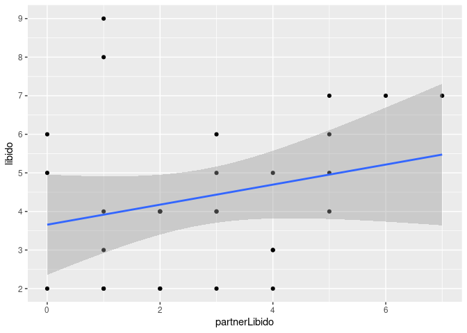

Ancova
================

``` r
library(car)
```

    ## Loading required package: carData

``` r
library(pastecs)
library(WRS)
```

    ## Loading required package: MASS

    ## Loading required package: akima

    ## Loading required package: robustbase

    ## 
    ## Attaching package: 'WRS'

    ## The following object is masked from 'package:robustbase':
    ## 
    ##     hard.rejection

    ## The following object is masked from 'package:MASS':
    ## 
    ##     ltsreg

    ## The following object is masked from 'package:car':
    ## 
    ##     ellipse

    ## The following object is masked from 'package:stats':
    ## 
    ##     ecdf

    ## The following object is masked from 'package:grDevices':
    ## 
    ##     bmp

``` r
library(multcomp)
```

    ## Loading required package: mvtnorm

    ## Loading required package: survival

    ## 
    ## Attaching package: 'survival'

    ## The following object is masked from 'package:robustbase':
    ## 
    ##     heart

    ## Loading required package: TH.data

    ## 
    ## Attaching package: 'TH.data'

    ## The following object is masked from 'package:MASS':
    ## 
    ##     geyser

``` r
library(compute.es)
library(effects)
```

    ## Registered S3 methods overwritten by 'lme4':
    ##   method                          from
    ##   cooks.distance.influence.merMod car 
    ##   influence.merMod                car 
    ##   dfbeta.influence.merMod         car 
    ##   dfbetas.influence.merMod        car

    ## lattice theme set by effectsTheme()
    ## See ?effectsTheme for details.

``` r
library(ggplot2)
library(dplyr)
```

    ## 
    ## Attaching package: 'dplyr'

    ## The following objects are masked from 'package:WRS':
    ## 
    ##     near, pull

    ## The following object is masked from 'package:MASS':
    ## 
    ##     select

    ## The following objects are masked from 'package:pastecs':
    ## 
    ##     first, last

    ## The following object is masked from 'package:car':
    ## 
    ##     recode

    ## The following objects are masked from 'package:stats':
    ## 
    ##     filter, lag

    ## The following objects are masked from 'package:base':
    ## 
    ##     intersect, setdiff, setequal, union

``` r
df<- read.delim('/home/atrides/Desktop/R/statistics_with_R/11_GLM2_ANCOVA/Data_Files/ViagraCovariate.dat', header=TRUE)
head(df)
```

    ##   dose libido partnerLibido
    ## 1    1      3             4
    ## 2    1      2             1
    ## 3    1      5             5
    ## 4    1      2             1
    ## 5    1      2             2
    ## 6    1      2             2

``` r
# some basic means 
by(df$libido ,df$dose, mean)
```

    ## df$dose: 1
    ## [1] 3.222222
    ## ------------------------------------------------------------ 
    ## df$dose: 2
    ## [1] 4.875
    ## ------------------------------------------------------------ 
    ## df$dose: 3
    ## [1] 4.846154

``` r
by(df$partnerLibido ,df$dose, mean)
```

    ## df$dose: 1
    ## [1] 3.444444
    ## ------------------------------------------------------------ 
    ## df$dose: 2
    ## [1] 3.125
    ## ------------------------------------------------------------ 
    ## df$dose: 3
    ## [1] 2

``` r
is.factor(df$dose)
```

    ## [1] FALSE

``` r
df$dose<- factor(df$dose, levels=c(1,2,3))
```

``` r
# boxplots
box<- ggplot(df, aes(dose, libido))+
  geom_boxplot()+
  scale_y_continuous(limits = c(0, 10))
box
```

<!-- --> \#\#
checking homogeneity of variances

``` r
leveneTest(df$libido, df$dose)
```

    ## Levene's Test for Homogeneity of Variance (center = median)
    ##       Df F value Pr(>F)
    ## group  2  0.3256 0.7249
    ##       27

``` r
# also , could use Hartley F max test in addition , done in python notebook :)
```

``` r
# Checking assumption 1, independence of covariate and experimental manipulator
aov1<- aov(partnerLibido~dose, data=df)
summary(aov1)
```

    ##             Df Sum Sq Mean Sq F value Pr(>F)
    ## dose         2  12.77   6.385   1.979  0.158
    ## Residuals   27  87.10   3.226

``` r
# from summary we can see the relationship between groups and covariate is non-significant
# hence, our assumption is followed
```

``` r
m01<- aov(libido~dose+partnerLibido, data=df)
Anova(m01, type='III')  # defaults to type="II"
```

    ## Anova Table (Type III tests)
    ## 
    ## Response: libido
    ##               Sum Sq Df F value  Pr(>F)  
    ## (Intercept)   12.943  1  4.2572 0.04920 *
    ## dose          25.185  2  4.1419 0.02745 *
    ## partnerLibido 15.076  1  4.9587 0.03483 *
    ## Residuals     79.047 26                  
    ## ---
    ## Signif. codes:  0 '***' 0.001 '**' 0.01 '*' 0.05 '.' 0.1 ' ' 1

## Planned Contrasts

``` r
con1<- c(-2,1, 1)
con2<- c(0, 1,-1)
contrasts(df$dose)<- cbind(con1, con2)

contrast_model<- aov(libido~ dose+partnerLibido, data=df)
Anova(contrast_model, type="III")
```

    ## Anova Table (Type III tests)
    ## 
    ## Response: libido
    ##               Sum Sq Df F value    Pr(>F)    
    ## (Intercept)   76.069  1 25.0205 3.342e-05 ***
    ## dose          25.185  2  4.1419   0.02745 *  
    ## partnerLibido 15.076  1  4.9587   0.03483 *  
    ## Residuals     79.047 26                      
    ## ---
    ## Signif. codes:  0 '***' 0.001 '**' 0.01 '*' 0.05 '.' 0.1 ' ' 1

``` r
summary.lm(contrast_model)
```

    ## 
    ## Call:
    ## aov(formula = libido ~ dose + partnerLibido, data = df)
    ## 
    ## Residuals:
    ##     Min      1Q  Median      3Q     Max 
    ## -3.2622 -0.7899 -0.3230  0.8811  4.5699 
    ## 
    ## Coefficients:
    ##               Estimate Std. Error t value Pr(>|t|)    
    ## (Intercept)     3.1260     0.6250   5.002 3.34e-05 ***
    ## dosecon1        0.6684     0.2400   2.785  0.00985 ** 
    ## dosecon2       -0.2196     0.4056  -0.541  0.59284    
    ## partnerLibido   0.4160     0.1868   2.227  0.03483 *  
    ## ---
    ## Signif. codes:  0 '***' 0.001 '**' 0.01 '*' 0.05 '.' 0.1 ' ' 1
    ## 
    ## Residual standard error: 1.744 on 26 degrees of freedom
    ## Multiple R-squared:  0.2876, Adjusted R-squared:  0.2055 
    ## F-statistic:   3.5 on 3 and 26 DF,  p-value: 0.02954

## adjusting for the effect of covariate

``` r
adjustedMeans<- effect("dose", m01)
summary(adjustedMeans)
```

    ## 
    ##  dose effect
    ## dose
    ##        1        2        3 
    ## 2.926370 4.712050 5.151251 
    ## 
    ##  Lower 95 Percent Confidence Limits
    ## dose
    ##        1        2        3 
    ## 1.700854 3.435984 4.118076 
    ## 
    ##  Upper 95 Percent Confidence Limits
    ## dose
    ##        1        2        3 
    ## 4.151886 5.988117 6.184427

``` r
adjustedMeans$se
```

    ## [1] 0.5962045 0.6207971 0.5026323

``` r
# Interpreting the covariate
dotplot<- ggplot(df, aes(partnerLibido, libido))+
  geom_point()+
  geom_smooth(method='lm')+
  scale_y_continuous(breaks=pretty(df$libido,n=5))

dotplot
```

    ## `geom_smooth()` using formula 'y ~ x'

<!-- -->

``` r
# post hoc test in Ancova
# we can use only the glht() function; the pairwise.t.test() function will not test the adjusted means.

postHocs<- glht(m01, linfct=mcp(dose='Tukey'))
summary(postHocs)
```

    ## 
    ##   Simultaneous Tests for General Linear Hypotheses
    ## 
    ## Multiple Comparisons of Means: Tukey Contrasts
    ## 
    ## 
    ## Fit: aov(formula = libido ~ dose + partnerLibido, data = df)
    ## 
    ## Linear Hypotheses:
    ##            Estimate Std. Error t value Pr(>|t|)  
    ## 2 - 1 == 0   1.7857     0.8494   2.102   0.1087  
    ## 3 - 1 == 0   2.2249     0.8028   2.771   0.0264 *
    ## 3 - 2 == 0   0.4392     0.8112   0.541   0.8516  
    ## ---
    ## Signif. codes:  0 '***' 0.001 '**' 0.01 '*' 0.05 '.' 0.1 ' ' 1
    ## (Adjusted p values reported -- single-step method)

``` r
confint(postHocs)
```

    ## 
    ##   Simultaneous Confidence Intervals
    ## 
    ## Multiple Comparisons of Means: Tukey Contrasts
    ## 
    ## 
    ## Fit: aov(formula = libido ~ dose + partnerLibido, data = df)
    ## 
    ## Quantile = 2.4835
    ## 95% family-wise confidence level
    ##  
    ## 
    ## Linear Hypotheses:
    ##            Estimate lwr     upr    
    ## 2 - 1 == 0  1.7857  -0.3237  3.8951
    ## 3 - 1 == 0  2.2249   0.2311  4.2187
    ## 3 - 2 == 0  0.4392  -1.5755  2.4539

## plots in ancova

``` r
plot(m01)
```

<!-- --><!-- --><!-- --><!-- -->

``` r
# Final Remarks
model_justAnova<- aov(libido~dose, data=df)
summary(model_justAnova)
```

    ##             Df Sum Sq Mean Sq F value Pr(>F)
    ## dose         2  16.84   8.422   2.416  0.108
    ## Residuals   27  94.12   3.486

``` r
# so , if we hadn't taken covariate in our calculation , the resulting 
# summary would be incorrect and misleading
```

``` r
# Checking assumption of homegeniety of regression slopes
hoRS<- aov(libido~ dose*partnerLibido, data=df)
summary(hoRS)
```

    ##                    Df Sum Sq Mean Sq F value Pr(>F)  
    ## dose                2  16.84   8.422   3.448 0.0483 *
    ## partnerLibido       1  15.08  15.076   6.172 0.0203 *
    ## dose:partnerLibido  2  20.43  10.213   4.181 0.0277 *
    ## Residuals          24  58.62   2.443                 
    ## ---
    ## Signif. codes:  0 '***' 0.001 '**' 0.01 '*' 0.05 '.' 0.1 ' ' 1

``` r
# since the interaction term is significant , the assumption is broken
```

``` r
# also, we can plot this
hoRS_plot<- ggplot(df, aes(libido,partnerLibido))+
  geom_point(color='black')
  

q1 <- ggplot() +
  geom_smooth(data = filter(df, dose==1), aes(libido,partnerLibido,  color = "blue"), method = "lm")
q2 <- ggplot() +
  geom_smooth(data = filter(df, dose==2), aes(libido,partnerLibido,  color = "orange"), method = "lm")
q3 <- ggplot() +
  geom_smooth(data = filter(df, dose==3), aes(libido,partnerLibido,  color = "green"), method = "lm")

hoRS_plot<- hoRS_plot+q1$layers[[1]]+q2$layers[[1]]+q3$layers[[1]]
hoRS_plot
```

    ## `geom_smooth()` using formula 'y ~ x'
    ## `geom_smooth()` using formula 'y ~ x'
    ## `geom_smooth()` using formula 'y ~ x'

<!-- -->

## Effect Sizes

``` r
# partial R2
Anova(m01)
```

    ## Anova Table (Type II tests)
    ## 
    ## Response: libido
    ##               Sum Sq Df F value  Pr(>F)  
    ## dose          25.185  2  4.1419 0.02745 *
    ## partnerLibido 15.076  1  4.9587 0.03483 *
    ## Residuals     79.047 26                  
    ## ---
    ## Signif. codes:  0 '***' 0.001 '**' 0.01 '*' 0.05 '.' 0.1 ' ' 1

``` r
partial_R2_dose<- 25.185/(25.185+79.047)
partial_R2_partner<- 15.076/(15.076+79.047)

partial_R2_dose
```

    ## [1] 0.2416245

``` r
partial_R2_dose
```

    ## [1] 0.2416245

``` r
# R_Contrast
r_contrast<- function(t, dof){
  cat("r : ",sqrt(t^2/(t^2+dof)))
  
}

summary.lm(contrast_model)
```

    ## 
    ## Call:
    ## aov(formula = libido ~ dose + partnerLibido, data = df)
    ## 
    ## Residuals:
    ##     Min      1Q  Median      3Q     Max 
    ## -3.2622 -0.7899 -0.3230  0.8811  4.5699 
    ## 
    ## Coefficients:
    ##               Estimate Std. Error t value Pr(>|t|)    
    ## (Intercept)     3.1260     0.6250   5.002 3.34e-05 ***
    ## dosecon1        0.6684     0.2400   2.785  0.00985 ** 
    ## dosecon2       -0.2196     0.4056  -0.541  0.59284    
    ## partnerLibido   0.4160     0.1868   2.227  0.03483 *  
    ## ---
    ## Signif. codes:  0 '***' 0.001 '**' 0.01 '*' 0.05 '.' 0.1 ' ' 1
    ## 
    ## Residual standard error: 1.744 on 26 degrees of freedom
    ## Multiple R-squared:  0.2876, Adjusted R-squared:  0.2055 
    ## F-statistic:   3.5 on 3 and 26 DF,  p-value: 0.02954

``` r
r_contrast(2.785, 26)
```

    ## r :  0.4793451

``` r
r_contrast(-0.541, 26)
```

    ## r :  0.1055066

``` r
r_contrast(2.227, 26)
```

    ## r :  0.4002424

``` r
# an alternative of getting effect size of contrasts,
# is to get all pairwise effect sizes
summary(adjustedMeans)
```

    ## 
    ##  dose effect
    ## dose
    ##        1        2        3 
    ## 2.926370 4.712050 5.151251 
    ## 
    ##  Lower 95 Percent Confidence Limits
    ## dose
    ##        1        2        3 
    ## 1.700854 3.435984 4.118076 
    ## 
    ##  Upper 95 Percent Confidence Limits
    ## dose
    ##        1        2        3 
    ## 4.151886 5.988117 6.184427

``` r
n<- c(9,8,13)
adjustedMeans$sd<- adjustedMeans$se*sqrt(n)

adjustedMeans$sd
```

    ## [1] 1.788613 1.755879 1.812267

``` r
# placebo-low
mes(2.92, 4.71, 1.79, 1.46, 9,8)
```

    ## Mean Differences ES: 
    ##  
    ##  d [ 95 %CI] = -1.09 [ -2.11 , -0.07 ] 
    ##   var(d) = 0.27 
    ##   p-value(d) = 0.05 
    ##   U3(d) = 13.82 % 
    ##   CLES(d) = 22.07 % 
    ##   Cliff's Delta = -0.56 
    ##  
    ##  g [ 95 %CI] = -1.03 [ -2 , -0.06 ] 
    ##   var(g) = 0.24 
    ##   p-value(g) = 0.05 
    ##   U3(g) = 15.07 % 
    ##   CLES(g) = 23.25 % 
    ##  
    ##  Correlation ES: 
    ##  
    ##  r [ 95 %CI] = -0.5 [ -0.79 , -0.03 ] 
    ##   var(r) = 0.03 
    ##   p-value(r) = 0.06 
    ##  
    ##  z [ 95 %CI] = -0.55 [ -1.07 , -0.03 ] 
    ##   var(z) = 0.07 
    ##   p-value(z) = 0.06 
    ##  
    ##  Odds Ratio ES: 
    ##  
    ##  OR [ 95 %CI] = 0.14 [ 0.02 , 0.88 ] 
    ##   p-value(OR) = 0.05 
    ##  
    ##  Log OR [ 95 %CI] = -1.97 [ -3.83 , -0.12 ] 
    ##   var(lOR) = 0.89 
    ##   p-value(Log OR) = 0.05 
    ##  
    ##  Other: 
    ##  
    ##  NNT = -5.77 
    ##  Total N = 17

``` r
# high-low
mes(5.15, 4.71, 2.11, 1.46, 13,8)
```

    ## Mean Differences ES: 
    ##  
    ##  d [ 95 %CI] = 0.23 [ -0.65 , 1.12 ] 
    ##   var(d) = 0.2 
    ##   p-value(d) = 0.61 
    ##   U3(d) = 59.17 % 
    ##   CLES(d) = 56.52 % 
    ##   Cliff's Delta = 0.13 
    ##  
    ##  g [ 95 %CI] = 0.22 [ -0.63 , 1.07 ] 
    ##   var(g) = 0.19 
    ##   p-value(g) = 0.61 
    ##   U3(g) = 58.81 % 
    ##   CLES(g) = 56.26 % 
    ##  
    ##  Correlation ES: 
    ##  
    ##  r [ 95 %CI] = 0.12 [ -0.33 , 0.52 ] 
    ##   var(r) = 0.05 
    ##   p-value(r) = 0.62 
    ##  
    ##  z [ 95 %CI] = 0.12 [ -0.34 , 0.58 ] 
    ##   var(z) = 0.06 
    ##   p-value(z) = 0.62 
    ##  
    ##  Odds Ratio ES: 
    ##  
    ##  OR [ 95 %CI] = 1.52 [ 0.31 , 7.56 ] 
    ##   p-value(OR) = 0.61 
    ##  
    ##  Log OR [ 95 %CI] = 0.42 [ -1.18 , 2.02 ] 
    ##   var(lOR) = 0.67 
    ##   p-value(Log OR) = 0.61 
    ##  
    ##  Other: 
    ##  
    ##  NNT = 14.07 
    ##  Total N = 21

``` r
# high-placebo
mes(5.15, 2.92, 2.11, 1.79, 13,9)
```

    ## Mean Differences ES: 
    ##  
    ##  d [ 95 %CI] = 1.12 [ 0.21 , 2.03 ] 
    ##   var(d) = 0.22 
    ##   p-value(d) = 0.03 
    ##   U3(d) = 86.9 % 
    ##   CLES(d) = 78.61 % 
    ##   Cliff's Delta = 0.57 
    ##  
    ##  g [ 95 %CI] = 1.08 [ 0.2 , 1.96 ] 
    ##   var(g) = 0.2 
    ##   p-value(g) = 0.03 
    ##   U3(g) = 85.97 % 
    ##   CLES(g) = 77.73 % 
    ##  
    ##  Correlation ES: 
    ##  
    ##  r [ 95 %CI] = 0.5 [ 0.1 , 0.76 ] 
    ##   var(r) = 0.02 
    ##   p-value(r) = 0.03 
    ##  
    ##  z [ 95 %CI] = 0.55 [ 0.1 , 1 ] 
    ##   var(z) = 0.05 
    ##   p-value(z) = 0.03 
    ##  
    ##  Odds Ratio ES: 
    ##  
    ##  OR [ 95 %CI] = 7.65 [ 1.46 , 40 ] 
    ##   p-value(OR) = 0.03 
    ##  
    ##  Log OR [ 95 %CI] = 2.03 [ 0.38 , 3.69 ] 
    ##   var(lOR) = 0.71 
    ##   p-value(Log OR) = 0.03 
    ##  
    ##  Other: 
    ##  
    ##  NNT = 2.44 
    ##  Total N = 22
