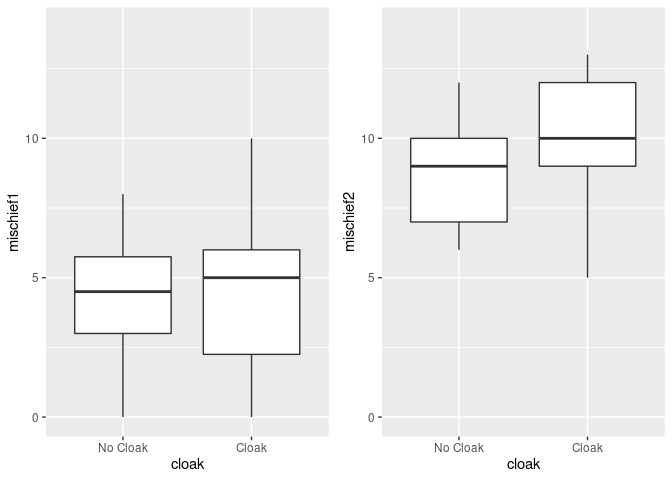
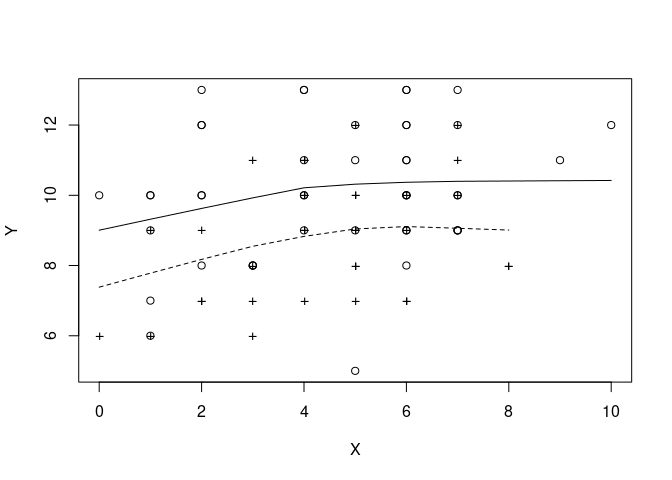

Robust Ancova
================

``` r
library(car)
```

    ## Loading required package: carData

``` r
library(pastecs)
library(WRS)
```

    ## Loading required package: MASS

    ## Loading required package: akima

    ## Loading required package: robustbase

    ## 
    ## Attaching package: 'WRS'

    ## The following object is masked from 'package:robustbase':
    ## 
    ##     hard.rejection

    ## The following object is masked from 'package:MASS':
    ## 
    ##     ltsreg

    ## The following object is masked from 'package:car':
    ## 
    ##     ellipse

    ## The following object is masked from 'package:stats':
    ## 
    ##     ecdf

    ## The following object is masked from 'package:grDevices':
    ## 
    ##     bmp

``` r
library(multcomp)
```

    ## Loading required package: mvtnorm

    ## Loading required package: survival

    ## 
    ## Attaching package: 'survival'

    ## The following object is masked from 'package:robustbase':
    ## 
    ##     heart

    ## Loading required package: TH.data

    ## 
    ## Attaching package: 'TH.data'

    ## The following object is masked from 'package:MASS':
    ## 
    ##     geyser

``` r
library(compute.es)
library(effects)
```

    ## Registered S3 methods overwritten by 'lme4':
    ##   method                          from
    ##   cooks.distance.influence.merMod car 
    ##   influence.merMod                car 
    ##   dfbeta.influence.merMod         car 
    ##   dfbetas.influence.merMod        car

    ## lattice theme set by effectsTheme()
    ## See ?effectsTheme for details.

``` r
library(ggplot2)
library(cowplot)
```

    ## 
    ## ********************************************************

    ## Note: As of version 1.0.0, cowplot does not change the

    ##   default ggplot2 theme anymore. To recover the previous

    ##   behavior, execute:
    ##   theme_set(theme_cowplot())

    ## ********************************************************

``` r
library(dplyr)
```

    ## 
    ## Attaching package: 'dplyr'

    ## The following objects are masked from 'package:WRS':
    ## 
    ##     near, pull

    ## The following object is masked from 'package:MASS':
    ## 
    ##     select

    ## The following objects are masked from 'package:pastecs':
    ## 
    ##     first, last

    ## The following object is masked from 'package:car':
    ## 
    ##     recode

    ## The following objects are masked from 'package:stats':
    ## 
    ##     filter, lag

    ## The following objects are masked from 'package:base':
    ## 
    ##     intersect, setdiff, setequal, union

``` r
df<- read.delim('/home/atrides/Desktop/R/statistics_with_R/11_GLM2_ANCOVA/Data_Files/CloakofInvisibility.dat', header=TRUE)

head(df)
```

    ##   cloak mischief1 mischief2
    ## 1     1         4        11
    ## 2     1         5         7
    ## 3     1         8         8
    ## 4     1         6         7
    ## 5     1         6        10
    ## 6     1         4         7

``` r
df$cloak<- factor(df$cloak, levels=c(1, 2), labels=c('No Cloak', 'Cloak'))

plot1<- ggplot(df, aes(cloak, mischief1))+
  geom_boxplot()+
  scale_y_continuous(limits = c(0,14))
plot2<- ggplot(df, aes(cloak, mischief2))+
  geom_boxplot()+
  scale_y_continuous(limits = c(0,14))

plot_grid(plot1, plot2, ncol=2, nrow=1)
```

<!-- -->

## for robust ancova , we have to get data in right format,

``` r
Cloak<- filter(df, cloak=="Cloak")
No_Cloak<- filter(df, cloak=="No Cloak")

covgrp1<- Cloak$mischief1
covgrp2<- No_Cloak$mischief1
dvgrp1<- Cloak$mischief2
dvgrp2<- No_Cloak$mischief2
```

## creating robust model, using ancova()

``` r
m1_robust<- ancova(covgrp1, dvgrp1, covgrp2 , dvgrp2, tr=.2)
```

    ## [1] "NOTE: Confidence intervals are adjusted to control the probability"
    ## [1] "of at least one Type I error."
    ## [1] "But p-values are not"

<!-- -->

``` r
m1_robust
```

    ## $output
    ##      X n1 n2      DIF     TEST        se      ci.low    ci.hi     p.value
    ## [1,] 2 21 17 1.405594 1.888193 0.7444124 -0.67338339 3.484572 0.072261241
    ## [2,] 4 31 26 1.733553 3.130180 0.5538189  0.22699584 3.240109 0.003719873
    ## [3,] 5 32 26 1.012500 1.676646 0.6038842 -0.63942982 2.664430 0.104360221
    ## [4,] 6 29 24 1.171053 2.310930 0.5067452 -0.20585352 2.547959 0.027303929
    ## [5,] 7 24 17 1.375000 2.614530 0.5259071 -0.07907858 2.829079 0.015021056
    ##      crit.val
    ## [1,] 2.792777
    ## [2,] 2.720306
    ## [3,] 2.735508
    ## [4,] 2.717157
    ## [5,] 2.764896

## creating robust model, using ancboot()

``` r
m2_robust<- ancboot(covgrp1, dvgrp1, covgrp2 , dvgrp2, nboot=2000)
```

    ## [1] "Note: confidence intervals are adjusted to control FWE"
    ## [1] "But p-values are not adjusted to control FWE"
    ## [1] "Taking bootstrap samples. Please wait."

<!-- -->

``` r
m2_robust
```

    ## $output
    ##      X n1 n2      DIF     TEST      ci.low    ci.hi p.value
    ## [1,] 2 21 17 1.405594 1.888193 -0.66993011 3.481119  0.0840
    ## [2,] 4 31 26 1.733553 3.130180  0.18942909 3.277676  0.0070
    ## [3,] 5 32 26 1.012500 1.676646 -0.67121254 2.696213  0.0965
    ## [4,] 6 29 24 1.171053 2.310930 -0.24182295 2.583928  0.0295
    ## [5,] 7 24 17 1.375000 2.614530 -0.09130166 2.841302  0.0130
    ## 
    ## $crit
    ## [1] 2.788138
