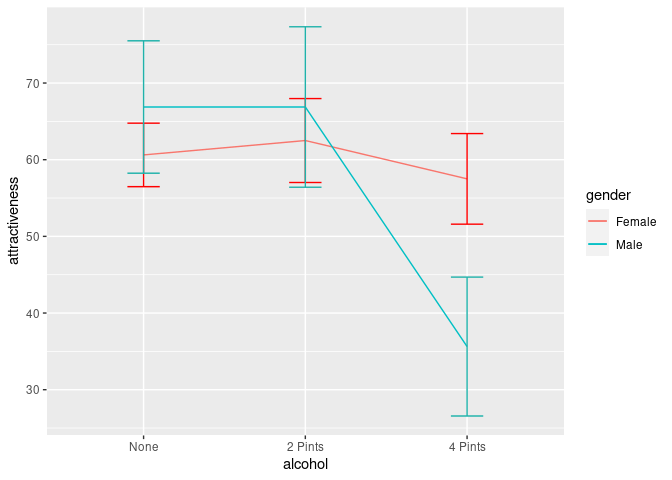
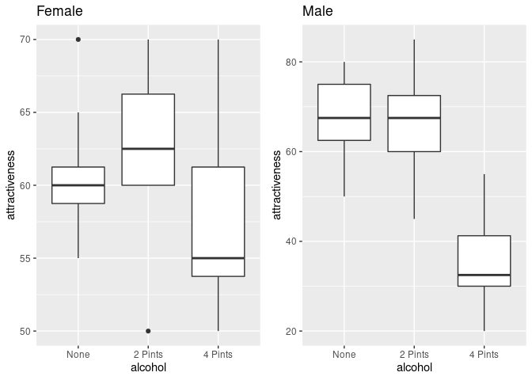
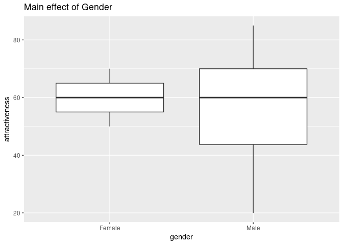
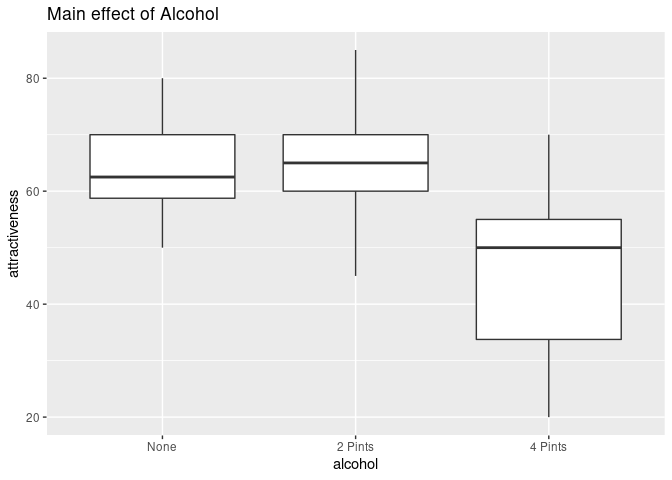
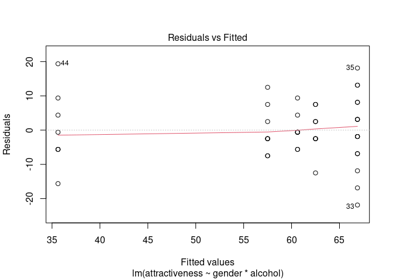
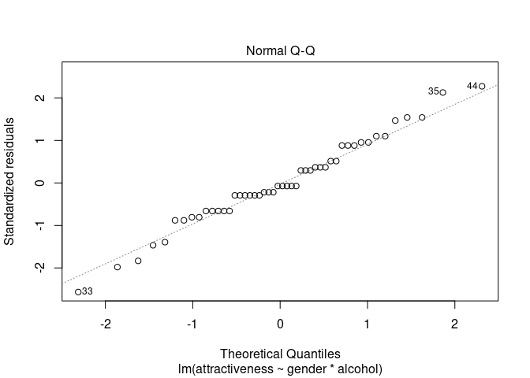
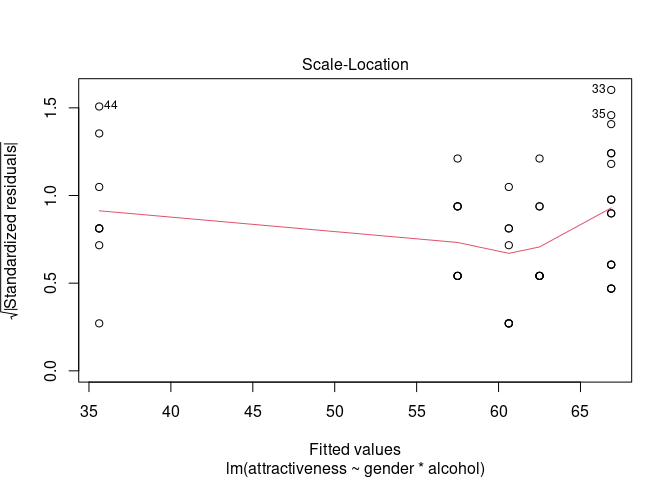
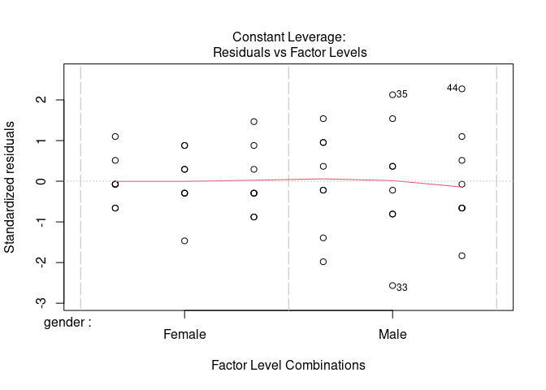
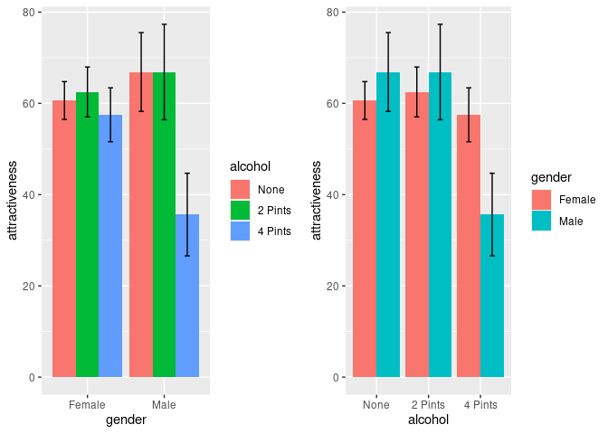

Factorial Anova
================

``` r
library(car)
```

    ## Loading required package: carData

``` r
library(compute.es)
library(multcomp)
```

    ## Loading required package: mvtnorm

    ## Loading required package: survival

    ## Loading required package: TH.data

    ## Loading required package: MASS

    ## 
    ## Attaching package: 'TH.data'

    ## The following object is masked from 'package:MASS':
    ## 
    ##     geyser

``` r
library(WRS)
```

    ## Loading required package: akima

    ## Loading required package: robustbase

    ## 
    ## Attaching package: 'robustbase'

    ## The following object is masked from 'package:survival':
    ## 
    ##     heart

    ## 
    ## Attaching package: 'WRS'

    ## The following object is masked from 'package:robustbase':
    ## 
    ##     hard.rejection

    ## The following object is masked from 'package:MASS':
    ## 
    ##     ltsreg

    ## The following object is masked from 'package:car':
    ## 
    ##     ellipse

    ## The following object is masked from 'package:stats':
    ## 
    ##     ecdf

    ## The following object is masked from 'package:grDevices':
    ## 
    ##     bmp

``` r
library(reshape)
library(pastecs)
library(ggplot2)
library(dplyr)
```

    ## 
    ## Attaching package: 'dplyr'

    ## The following objects are masked from 'package:pastecs':
    ## 
    ##     first, last

    ## The following object is masked from 'package:reshape':
    ## 
    ##     rename

    ## The following objects are masked from 'package:WRS':
    ## 
    ##     near, pull

    ## The following object is masked from 'package:MASS':
    ## 
    ##     select

    ## The following object is masked from 'package:car':
    ## 
    ##     recode

    ## The following objects are masked from 'package:stats':
    ## 
    ##     filter, lag

    ## The following objects are masked from 'package:base':
    ## 
    ##     intersect, setdiff, setequal, union

``` r
library(cowplot)
```

    ## 
    ## ********************************************************

    ## Note: As of version 1.0.0, cowplot does not change the

    ##   default ggplot2 theme anymore. To recover the previous

    ##   behavior, execute:
    ##   theme_set(theme_cowplot())

    ## ********************************************************

    ## 
    ## Attaching package: 'cowplot'

    ## The following object is masked from 'package:reshape':
    ## 
    ##     stamp

``` r
df<- read.csv('/home/atrides/Desktop/R/statistics_with_R/12_GLM3_FactorialAnova/Data_Files/goggles.csv')

head(df)
```

    ##   gender alcohol attractiveness
    ## 1 Female    None             65
    ## 2 Female    None             70
    ## 3 Female    None             60
    ## 4 Female    None             60
    ## 5 Female    None             60
    ## 6 Female    None             55

``` r
df$gender<- factor(df$gender)
df$alcohol<- factor(df$alcohol, levels=c("None", "2 Pints", "4 Pints"))

# also, we can plot this
inter_plot<- ggplot()
q1 <- ggplot() +
  stat_summary(fun=mean, geom="line", data=filter(df, gender=="Female"), aes(alcohol,attractiveness, group="Female", colour=gender))+
  stat_summary(fun.data =mean_cl_normal, geom="errorbar", data=filter(df, gender=="Female"), aes(alcohol,attractiveness), colour="red", width=0.2)
q2 <- ggplot() +
  stat_summary(fun=mean, geom="line", data=filter(df, gender=="Male"), aes(alcohol,attractiveness, group="Male",colour=gender))+
  stat_summary(fun.data =mean_cl_normal, geom="errorbar", data=filter(df, gender=="Male"), aes(alcohol,attractiveness),colour="#20B2AA", width=0.2)

inter_plot<- inter_plot +q1$layers[[1]]+q1$layers[[2]]+q2$layers[[1]]+q2$layers[[2]]
inter_plot
```

<!-- -->

``` r
# box plots
female_box<- ggplot(filter(df, gender=="Female"), aes(alcohol, attractiveness))+
  geom_boxplot()+
  ggtitle('Female')
male_box<- ggplot(filter(df, gender=="Male"), aes(alcohol, attractiveness))+
  geom_boxplot()+
  ggtitle('Male')

plot_grid(female_box, male_box, nrow=1, ncol=2)
```

<!-- -->
\#\# Some descriptive statistics

``` r
# descriptive statistics using interaction
by(df$attractiveness, list( df$alcohol, df$gender), stat.desc)
```

    ## : None
    ## : Female
    ##      nbr.val     nbr.null       nbr.na          min          max        range 
    ##   8.00000000   0.00000000   0.00000000  55.00000000  70.00000000  15.00000000 
    ##          sum       median         mean      SE.mean CI.mean.0.95          var 
    ## 485.00000000  60.00000000  60.62500000   1.75191222   4.14261412  24.55357143 
    ##      std.dev     coef.var 
    ##   4.95515604   0.08173453 
    ## ------------------------------------------------------------ 
    ## : 2 Pints
    ## : Female
    ##      nbr.val     nbr.null       nbr.na          min          max        range 
    ##    8.0000000    0.0000000    0.0000000   50.0000000   70.0000000   20.0000000 
    ##          sum       median         mean      SE.mean CI.mean.0.95          var 
    ##  500.0000000   62.5000000   62.5000000    2.3145502    5.4730417   42.8571429 
    ##      std.dev     coef.var 
    ##    6.5465367    0.1047446 
    ## ------------------------------------------------------------ 
    ## : 4 Pints
    ## : Female
    ##      nbr.val     nbr.null       nbr.na          min          max        range 
    ##    8.0000000    0.0000000    0.0000000   50.0000000   70.0000000   20.0000000 
    ##          sum       median         mean      SE.mean CI.mean.0.95          var 
    ##  460.0000000   55.0000000   57.5000000    2.5000000    5.9115606   50.0000000 
    ##      std.dev     coef.var 
    ##    7.0710678    0.1229751 
    ## ------------------------------------------------------------ 
    ## : None
    ## : Male
    ##      nbr.val     nbr.null       nbr.na          min          max        range 
    ##    8.0000000    0.0000000    0.0000000   50.0000000   80.0000000   30.0000000 
    ##          sum       median         mean      SE.mean CI.mean.0.95          var 
    ##  535.0000000   67.5000000   66.8750000    3.6519931    8.6355914  106.6964286 
    ##      std.dev     coef.var 
    ##   10.3293963    0.1544583 
    ## ------------------------------------------------------------ 
    ## : 2 Pints
    ## : Male
    ##      nbr.val     nbr.null       nbr.na          min          max        range 
    ##    8.0000000    0.0000000    0.0000000   45.0000000   85.0000000   40.0000000 
    ##          sum       median         mean      SE.mean CI.mean.0.95          var 
    ##  535.0000000   67.5000000   66.8750000    4.4257263   10.4651798  156.6964286 
    ##      std.dev     coef.var 
    ##   12.5178444    0.1871827 
    ## ------------------------------------------------------------ 
    ## : 4 Pints
    ## : Male
    ##      nbr.val     nbr.null       nbr.na          min          max        range 
    ##    8.0000000    0.0000000    0.0000000   20.0000000   55.0000000   35.0000000 
    ##          sum       median         mean      SE.mean CI.mean.0.95          var 
    ##  285.0000000   32.5000000   35.6250000    3.8309711    9.0588071  117.4107143 
    ##      std.dev     coef.var 
    ##   10.8356225    0.3041578

## levene test on interaction of variables

``` r
leveneTest(df$attractiveness, interaction(df$gender, df$alcohol), center=median)
```

    ## Levene's Test for Homogeneity of Variance (center = median)
    ##       Df F value Pr(>F)
    ## group  5  1.4252 0.2351
    ##       42

``` r
m00<- lm(attractiveness~gender*alcohol, data=df)
summary(m00)
```

    ## 
    ## Call:
    ## lm(formula = attractiveness ~ gender * alcohol, data = df)
    ## 
    ## Residuals:
    ##     Min      1Q  Median      3Q     Max 
    ## -21.875  -5.625  -0.625   5.156  19.375 
    ## 
    ## Coefficients:
    ##                           Estimate Std. Error t value Pr(>|t|)    
    ## (Intercept)                 60.625      3.222  18.818  < 2e-16 ***
    ## genderMale                   6.250      4.556   1.372    0.177    
    ## alcohol2 Pints               1.875      4.556   0.412    0.683    
    ## alcohol4 Pints              -3.125      4.556  -0.686    0.497    
    ## genderMale:alcohol2 Pints   -1.875      6.443  -0.291    0.772    
    ## genderMale:alcohol4 Pints  -28.125      6.443  -4.365 8.12e-05 ***
    ## ---
    ## Signif. codes:  0 '***' 0.001 '**' 0.01 '*' 0.05 '.' 0.1 ' ' 1
    ## 
    ## Residual standard error: 9.112 on 42 degrees of freedom
    ## Multiple R-squared:  0.6111, Adjusted R-squared:  0.5648 
    ## F-statistic:  13.2 on 5 and 42 DF,  p-value: 9.609e-08

## Planned Contrast

``` r
contrasts(df$alcohol)<-cbind(c(-2, 1, 1), c(0, -1, 1))
contrasts(df$gender)<-c(-1, 1)

m01<- aov(attractiveness~gender*alcohol, data=df)
Anova(m01, type="III")
```

    ## Anova Table (Type III tests)
    ## 
    ## Response: attractiveness
    ##                Sum Sq Df   F value    Pr(>F)    
    ## (Intercept)    163333  1 1967.0251 < 2.2e-16 ***
    ## gender            169  1    2.0323    0.1614    
    ## alcohol          3332  2   20.0654 7.649e-07 ***
    ## gender:alcohol   1978  2   11.9113 7.987e-05 ***
    ## Residuals        3488 42                        
    ## ---
    ## Signif. codes:  0 '***' 0.001 '**' 0.01 '*' 0.05 '.' 0.1 ' ' 1

``` r
summary.lm(m01)
```

    ## 
    ## Call:
    ## aov(formula = attractiveness ~ gender * alcohol, data = df)
    ## 
    ## Residuals:
    ##     Min      1Q  Median      3Q     Max 
    ## -21.875  -5.625  -0.625   5.156  19.375 
    ## 
    ## Coefficients:
    ##                  Estimate Std. Error t value Pr(>|t|)    
    ## (Intercept)        58.333      1.315  44.351  < 2e-16 ***
    ## gender1            -1.875      1.315  -1.426 0.161382    
    ## alcohol1           -2.708      0.930  -2.912 0.005727 ** 
    ## alcohol2           -9.062      1.611  -5.626 1.37e-06 ***
    ## gender1:alcohol1   -2.500      0.930  -2.688 0.010258 *  
    ## gender1:alcohol2   -6.562      1.611  -4.074 0.000201 ***
    ## ---
    ## Signif. codes:  0 '***' 0.001 '**' 0.01 '*' 0.05 '.' 0.1 ' ' 1
    ## 
    ## Residual standard error: 9.112 on 42 degrees of freedom
    ## Multiple R-squared:  0.6111, Adjusted R-squared:  0.5648 
    ## F-statistic:  13.2 on 5 and 42 DF,  p-value: 9.609e-08

### main effect of gender

``` r
gender_box<- ggplot(df, aes(gender, attractiveness))+
  geom_boxplot()+
  ggtitle("Main effect of Gender")
gender_box
```

<!-- -->
\#\#\# main effect of alcohol

``` r
alcohol_box<- ggplot(df, aes(alcohol, attractiveness))+
  geom_boxplot()+
  ggtitle("Main effect of Alcohol")
alcohol_box
```

<!-- -->

``` r
# Effect analysis in R
df$simple<- gl(6,8)
df$simple<- factor(df$simple, levels = c(1:6) , labels = c("F_None", "F_2", "F_4", "M_None", "M_2", "M_4"))

alcEffect1<-c(-2, 1, 1, -2, 1, 1)
alcEffect2<-c(0, -1, 1, 0, -1, 1)
gender_none<-c(-1, 0, 0, 1, 0, 0)
gender_twoPint<-c(0, -1, 0, 0, 1, 0)
gender_fourPint<-c(0, 0, -1, 0, 0, 1)

simpleEff<-cbind(alcEffect1, alcEffect2, gender_none, gender_twoPint, gender_fourPint)

contrasts(df$simple)<- simpleEff

# Creating an anova model for effect analysis
model_effectAnalysis<- aov(attractiveness~simple, data=df)
summary.lm(model_effectAnalysis)
```

    ## 
    ## Call:
    ## aov(formula = attractiveness ~ simple, data = df)
    ## 
    ## Residuals:
    ##     Min      1Q  Median      3Q     Max 
    ## -21.875  -5.625  -0.625   5.156  19.375 
    ## 
    ## Coefficients:
    ##                       Estimate Std. Error t value Pr(>|t|)    
    ## (Intercept)             58.333      1.315  44.351  < 2e-16 ***
    ## simplealcEffect1        -2.708      0.930  -2.912  0.00573 ** 
    ## simplealcEffect2        -9.062      1.611  -5.626 1.37e-06 ***
    ## simplegender_none        3.125      2.278   1.372  0.17742    
    ## simplegender_twoPint     2.188      2.278   0.960  0.34243    
    ## simplegender_fourPint  -10.938      2.278  -4.801 2.02e-05 ***
    ## ---
    ## Signif. codes:  0 '***' 0.001 '**' 0.01 '*' 0.05 '.' 0.1 ' ' 1
    ## 
    ## Residual standard error: 9.112 on 42 degrees of freedom
    ## Multiple R-squared:  0.6111, Adjusted R-squared:  0.5648 
    ## F-statistic:  13.2 on 5 and 42 DF,  p-value: 9.609e-08

## Post-Hoc tests

``` r
# using pairwise.t.test()
pairwise.t.test(df$attractiveness, df$simple, p.adjust.method = "bonferroni")
```

    ## 
    ##  Pairwise comparisons using t tests with pooled SD 
    ## 
    ## data:  df$attractiveness and df$simple 
    ## 
    ##        F_None  F_2     F_4    M_None  M_2    
    ## F_2    1.0000  -       -      -       -      
    ## F_4    1.0000  1.0000  -      -       -      
    ## M_None 1.0000  1.0000  0.6880 -       -      
    ## M_2    1.0000  1.0000  0.6880 1.0000  -      
    ## M_4    3.2e-05 8.3e-06 0.0003 3.5e-07 3.5e-07
    ## 
    ## P value adjustment method: bonferroni

### some plots

``` r
plot(m00)
```

<!-- --><!-- --><!-- --><!-- -->

``` r
# one more interaction graph
bar<-ggplot(df, aes(gender,attractiveness,fill=alcohol))
bar<- bar+stat_summary(fun=mean, geom='bar',position ='dodge')+ 
  stat_summary(fun.data = mean_cl_normal, geom = "errorbar", position = position_dodge(width=0.90), width = 0.2)

bar_<-ggplot(df, aes(alcohol,attractiveness,fill=gender))
bar_<- bar_+stat_summary(fun=mean, geom='bar',position ='dodge')+ 
  stat_summary(fun.data = mean_cl_normal, geom = "errorbar", position = position_dodge(width=0.90), width = 0.2)
plot_grid(bar, bar_, nrow=1, ncol=2)
```

<!-- -->

# Robust Factorial Anova

``` r
df<- df[, cbind('gender', 'alcohol', 'attractiveness')]

df$row<- rep(1:8, 6)

Melted<-melt(df, id = c("row", "gender", "alcohol"), measured = c("attractiveness"))

df_wide<- cast(Melted, row~gender+alcohol)
df_wide$row<- NULL
df_wide
```

    ##   Female_None Female_2 Pints Female_4 Pints Male_None Male_2 Pints Male_4 Pints
    ## 1          65             70             55        50           45           30
    ## 2          70             65             65        55           60           30
    ## 3          60             60             70        80           85           30
    ## 4          60             70             55        65           65           55
    ## 5          60             65             55        70           70           35
    ## 6          55             60             60        75           70           20
    ## 7          60             60             50        75           80           45
    ## 8          55             50             50        65           60           40

## Conducting Robust anova

#### t2way(levels of factor A, levels of factor B, data, tr = .2, alpha = .05)

``` r
t2way(2,3,df_wide)
```

    ## $Qa
    ## [1] 1.666667
    ## 
    ## $A.p.value
    ## [1] 0.209
    ## 
    ## $Qb
    ## [1] 48.2845
    ## 
    ## $B.p.value
    ## [1] 0.001
    ## 
    ## $Qab
    ## [1] 26.25718
    ## 
    ## $AB.p.value
    ## [1] 0.001
    ## 
    ## $means
    ##      [,1]     [,2]     [,3]
    ## [1,] 60.0 63.33333 56.66667
    ## [2,] 67.5 67.50000 35.00000

#### pbad2way(levels of factor A, levels of factor B, data, est = mom, nboot = 2000)

``` r
pbad2way(2,3, df_wide)
```

    ## [1] "Taking bootstrap samples. Please wait."

    ## $sig.levelA
    ## [1] NA
    ## 
    ## $sig.levelB
    ## [1] NA
    ## 
    ## $sig.levelAB
    ## [1] NA
    ## 
    ## $conA
    ##      [,1]
    ## [1,]    1
    ## [2,]    1
    ## [3,]    1
    ## [4,]   -1
    ## [5,]   -1
    ## [6,]   -1
    ## 
    ## $conB
    ##      [,1] [,2] [,3]
    ## [1,]    1    1    0
    ## [2,]   -1    0    1
    ## [3,]    0   -1   -1
    ## [4,]    1    1    0
    ## [5,]   -1    0    1
    ## [6,]    0   -1   -1
    ## 
    ## $conAB
    ##      [,1] [,2] [,3]
    ## [1,]    1    1    0
    ## [2,]   -1    0    1
    ## [3,]    0   -1   -1
    ## [4,]   -1   -1    0
    ## [5,]    1    0   -1
    ## [6,]    0    1    1

## Robust Post-hoc tests

``` r
mcp2atm(2, 3,df_wide)
```

    ## [1] "Note: confidence intervals are adjusted to control FWE"
    ## [1] "But p-values are not adjusted to control FWE"
    ## [1] "Note: confidence intervals are adjusted to control FWE"
    ## [1] "But p-values are not adjusted to control FWE"
    ## [1] "Note: confidence intervals are adjusted to control FWE"
    ## [1] "But p-values are not adjusted to control FWE"

    ## $Factor.A
    ## $Factor.A$n
    ## [1] 8 8 8 8 8 8
    ## 
    ## $Factor.A$test
    ##      con.num     test     crit       se       df
    ## [1,]       1 1.290994 2.065879 7.745967 23.57301
    ## 
    ## $Factor.A$psihat
    ##      con.num psihat  ci.lower ci.upper   p.value
    ## [1,]       1     10 -6.002228 26.00223 0.2092233
    ## 
    ## 
    ## $Factor.B
    ## $Factor.B$n
    ## [1] 8 8 8 8 8 8
    ## 
    ## $Factor.B$test
    ##      con.num       test     crit       se       df
    ## [1,]       1 -0.5203149 2.678921 6.406377 14.50207
    ## [2,]       2  5.7486837 2.647995 6.233311 16.11968
    ## [3,]       3  6.1847459 2.636865 6.332785 16.81814
    ## 
    ## $Factor.B$psihat
    ##      con.num    psihat  ci.lower ci.upper      p.value
    ## [1,]       1 -3.333333 -20.49551 13.82885 6.106962e-01
    ## [2,]       2 35.833333  19.32755 52.33911 2.905447e-05
    ## [3,]       3 39.166667  22.46796 55.86537 1.047835e-05
    ## 
    ## 
    ## $Factor.AB
    ## $Factor.AB$n
    ## [1] 8 8 8 8 8 8
    ## 
    ## $Factor.AB$test
    ##      con.num       test     crit       se       df
    ## [1,]       1 -0.5203149 2.678921 6.406377 14.50207
    ## [2,]       2 -4.6791611 2.647995 6.233311 16.11968
    ## [3,]       3 -4.0793005 2.636865 6.332785 16.81814
    ## 
    ## $Factor.AB$psihat
    ##      con.num     psihat  ci.lower   ci.upper      p.value
    ## [1,]       1  -3.333333 -20.49551  13.828847 0.6106961628
    ## [2,]       2 -29.166667 -45.67245 -12.660888 0.0002466289
    ## [3,]       3 -25.833333 -42.53204  -9.134631 0.0007964981
    ## 
    ## 
    ## $All.Tests
    ## [1] NA
    ## 
    ## $conA
    ##      [,1]
    ## [1,]    1
    ## [2,]    1
    ## [3,]    1
    ## [4,]   -1
    ## [5,]   -1
    ## [6,]   -1
    ## 
    ## $conB
    ##      [,1] [,2] [,3]
    ## [1,]    1    1    0
    ## [2,]   -1    0    1
    ## [3,]    0   -1   -1
    ## [4,]    1    1    0
    ## [5,]   -1    0    1
    ## [6,]    0   -1   -1
    ## 
    ## $conAB
    ##      [,1] [,2] [,3]
    ## [1,]    1    1    0
    ## [2,]   -1    0    1
    ## [3,]    0   -1   -1
    ## [4,]   -1   -1    0
    ## [5,]    1    0   -1
    ## [6,]    0    1    1

``` r
mcp2a(2,3,df_wide)
```

    ## [1] "Taking bootstrap samples. Please wait."
    ## [1] "Working on group  1"
    ## [1] "Working on group  2"
    ## [1] "Working on group  3"
    ## [1] "Working on group  4"
    ## [1] "Working on group  5"
    ## [1] "Working on group  6"

    ## $FactorA
    ##      con.num   psihat sig.test sig.crit  ci.lower ci.upper
    ## [1,]       1 14.46429   0.1465    0.025 -9.392857 28.60714
    ## 
    ## $FactorB
    ##      con.num   psihat sig.test sig.crit  ci.lower ci.upper
    ## [1,]       1 -5.00000    0.374    0.025 -18.75000 13.30357
    ## [2,]       2 35.80357    0.000    0.025  19.50000 50.96429
    ## [3,]       3 40.80357    0.000    0.025  22.29167 54.13690
    ## 
    ## $Interactions
    ##      con.num    psihat sig.test sig.crit  ci.lower   ci.upper
    ## [1,]       1  -5.00000   0.3095    0.025 -19.50000  12.500000
    ## [2,]       2 -32.23214   0.0005    0.025 -45.35714 -13.750000
    ## [3,]       3 -27.23214   0.0015    0.025 -42.97619  -8.541667
    ## 
    ## $conA
    ##      [,1]
    ## [1,]    1
    ## [2,]    1
    ## [3,]    1
    ## [4,]   -1
    ## [5,]   -1
    ## [6,]   -1
    ## 
    ## $conB
    ##      [,1] [,2] [,3]
    ## [1,]    1    1    0
    ## [2,]   -1    0    1
    ## [3,]    0   -1   -1
    ## [4,]    1    1    0
    ## [5,]   -1    0    1
    ## [6,]    0   -1   -1
    ## 
    ## $conAB
    ##      [,1] [,2] [,3]
    ## [1,]    1    1    0
    ## [2,]   -1    0    1
    ## [3,]    0   -1   -1
    ## [4,]   -1   -1    0
    ## [5,]    1    0   -1
    ## [6,]    0    1    1

## Effect Size

``` r
omega_factorial<-function(n, a, b, SSa, SSb, SSab, SSr){    
  MSa<-SSa/(a-1)    
  MSb<-SSb/(b-1)    
  MSab<-SSab/((a-1)*(b-1))    
  MSr<-SSr/(a*b*(n-1))    
  varA<-((a-1)*(MSa-MSr))/(n*a*b)    
  varB<-((b-1)*(MSb-MSr))/(n*a*b)    
  varAB<-((a-1)*(b-1)*(MSab-MSr))/(n*a*b)    
  varTotal<-varA + varB + varAB + MSr    
  print(paste("Omega-Squared A: ", varA/varTotal))    
  print(paste("Omega-Squared B: ", varB/varTotal))    
  print(paste("Omega-Squared AB: ", varAB/varTotal)) 
}

omega_factorial(8, 2, 3, 169, 3332, 1978, 3488)
```

    ## [1] "Omega-Squared A:  0.00949745068429001"
    ## [1] "Omega-Squared B:  0.34982188991376"
    ## [1] "Omega-Squared AB:  0.200209417472152"

### Effect sizes of gender at different level of alcohol

``` r
# mes(mean_males, mean_females, sd_males, sd_females, n_males, n_females)
mes(66.875, 60.625, 10.3293963, 4.95515604, 8, 8)
```

    ## Mean Differences ES: 
    ##  
    ##  d [ 95 %CI] = 0.77 [ -0.24 , 1.79 ] 
    ##   var(d) = 0.27 
    ##   p-value(d) = 0.16 
    ##   U3(d) = 77.98 % 
    ##   CLES(d) = 70.73 % 
    ##   Cliff's Delta = 0.41 
    ##  
    ##  g [ 95 %CI] = 0.73 [ -0.23 , 1.69 ] 
    ##   var(g) = 0.24 
    ##   p-value(g) = 0.16 
    ##   U3(g) = 76.71 % 
    ##   CLES(g) = 69.7 % 
    ##  
    ##  Correlation ES: 
    ##  
    ##  r [ 95 %CI] = 0.38 [ -0.14 , 0.74 ] 
    ##   var(r) = 0.04 
    ##   p-value(r) = 0.17 
    ##  
    ##  z [ 95 %CI] = 0.4 [ -0.14 , 0.95 ] 
    ##   var(z) = 0.08 
    ##   p-value(z) = 0.17 
    ##  
    ##  Odds Ratio ES: 
    ##  
    ##  OR [ 95 %CI] = 4.05 [ 0.64 , 25.58 ] 
    ##   p-value(OR) = 0.16 
    ##  
    ##  Log OR [ 95 %CI] = 1.4 [ -0.44 , 3.24 ] 
    ##   var(lOR) = 0.88 
    ##   p-value(Log OR) = 0.16 
    ##  
    ##  Other: 
    ##  
    ##  NNT = 3.68 
    ##  Total N = 16

``` r
mes(66.875, 62.5, 12.5178444, 6.5465367, 8, 8)
```

    ## Mean Differences ES: 
    ##  
    ##  d [ 95 %CI] = 0.44 [ -0.55 , 1.43 ] 
    ##   var(d) = 0.26 
    ##   p-value(d) = 0.4 
    ##   U3(d) = 66.93 % 
    ##   CLES(d) = 62.16 % 
    ##   Cliff's Delta = 0.24 
    ##  
    ##  g [ 95 %CI] = 0.41 [ -0.52 , 1.35 ] 
    ##   var(g) = 0.23 
    ##   p-value(g) = 0.4 
    ##   U3(g) = 66.06 % 
    ##   CLES(g) = 61.52 % 
    ##  
    ##  Correlation ES: 
    ##  
    ##  r [ 95 %CI] = 0.23 [ -0.3 , 0.65 ] 
    ##   var(r) = 0.06 
    ##   p-value(r) = 0.42 
    ##  
    ##  z [ 95 %CI] = 0.23 [ -0.31 , 0.78 ] 
    ##   var(z) = 0.08 
    ##   p-value(z) = 0.42 
    ##  
    ##  Odds Ratio ES: 
    ##  
    ##  OR [ 95 %CI] = 2.21 [ 0.37 , 13.37 ] 
    ##   p-value(OR) = 0.4 
    ##  
    ##  Log OR [ 95 %CI] = 0.79 [ -1 , 2.59 ] 
    ##   var(lOR) = 0.84 
    ##   p-value(Log OR) = 0.4 
    ##  
    ##  Other: 
    ##  
    ##  NNT = 6.98 
    ##  Total N = 16

``` r
mes(35.625, 57.5, 10.8356225, 7.0710678, 8, 8)
```

    ## Mean Differences ES: 
    ##  
    ##  d [ 95 %CI] = -2.39 [ -3.67 , -1.11 ] 
    ##   var(d) = 0.43 
    ##   p-value(d) = 0 
    ##   U3(d) = 0.84 % 
    ##   CLES(d) = 4.55 % 
    ##   Cliff's Delta = -0.91 
    ##  
    ##  g [ 95 %CI] = -2.26 [ -3.47 , -1.05 ] 
    ##   var(g) = 0.38 
    ##   p-value(g) = 0 
    ##   U3(g) = 1.19 % 
    ##   CLES(g) = 5.5 % 
    ##  
    ##  Correlation ES: 
    ##  
    ##  r [ 95 %CI] = -0.79 [ -0.92 , -0.48 ] 
    ##   var(r) = 0.01 
    ##   p-value(r) = 0 
    ##  
    ##  z [ 95 %CI] = -1.06 [ -1.61 , -0.52 ] 
    ##   var(z) = 0.08 
    ##   p-value(z) = 0 
    ##  
    ##  Odds Ratio ES: 
    ##  
    ##  OR [ 95 %CI] = 0.01 [ 0 , 0.13 ] 
    ##   p-value(OR) = 0 
    ##  
    ##  Log OR [ 95 %CI] = -4.34 [ -6.66 , -2.01 ] 
    ##   var(lOR) = 1.41 
    ##   p-value(Log OR) = 0 
    ##  
    ##  Other: 
    ##  
    ##  NNT = -5.02 
    ##  Total N = 16
