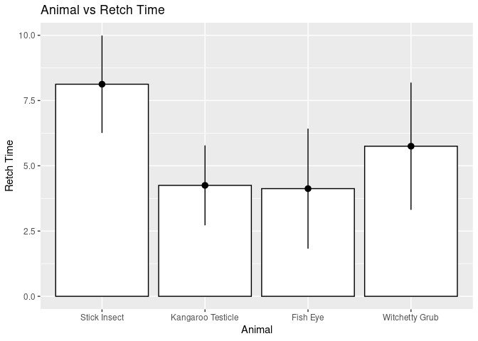
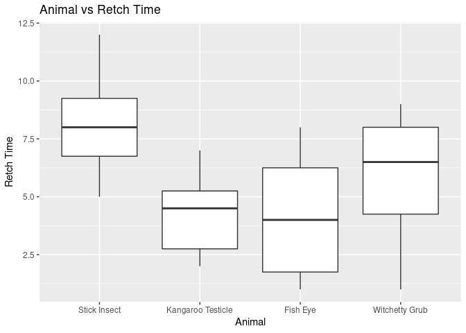

Repeated Measure Anova
================

``` r
library(ez)
```

    ## Registered S3 methods overwritten by 'lme4':
    ##   method                          from
    ##   cooks.distance.influence.merMod car 
    ##   influence.merMod                car 
    ##   dfbeta.influence.merMod         car 
    ##   dfbetas.influence.merMod        car

``` r
library(nlme)
library(ggplot2)
library(multcomp)
```

    ## Loading required package: mvtnorm

    ## Loading required package: survival

    ## Loading required package: TH.data

    ## Loading required package: MASS

    ## 
    ## Attaching package: 'TH.data'

    ## The following object is masked from 'package:MASS':
    ## 
    ##     geyser

``` r
library(pastecs)
library(WRS)
```

    ## Loading required package: akima

    ## Loading required package: robustbase

    ## 
    ## Attaching package: 'robustbase'

    ## The following object is masked from 'package:survival':
    ## 
    ##     heart

    ## 
    ## Attaching package: 'WRS'

    ## The following object is masked from 'package:robustbase':
    ## 
    ##     hard.rejection

    ## The following object is masked from 'package:MASS':
    ## 
    ##     ltsreg

    ## The following object is masked from 'package:stats':
    ## 
    ##     ecdf

    ## The following object is masked from 'package:grDevices':
    ## 
    ##     bmp

``` r
library(reshape)
```

``` r
df<- read.delim('/home/atrides/Desktop/R/statistics_with_R/13_GLM4_RepeatedMeasuresDesigns/Data_Files/Bushtucker.dat', header = TRUE)

head(df)
```

    ##   participant stick_insect kangaroo_testicle fish_eye witchetty_grub
    ## 1          P1            8                 7        1              6
    ## 2          P2            9                 5        2              5
    ## 3          P3            6                 2        3              8
    ## 4          P4            5                 3        1              9
    ## 5          P5            8                 4        5              8
    ## 6          P6            7                 5        6              7

``` r
df_long<- melt(df, id.vars = "participant", measure.vars = c("stick_insect","kangaroo_testicle","fish_eye", "witchetty_grub"), 
               variable_name = "Animal")

df_long$Animal<- factor(df_long$Animal, labels = c("Stick Insect", "Kangaroo Testicle", "Fish Eye", "Witchetty Grub"))
df_long$participant<- factor(df_long$participant)
is.factor(df_long$Animal)
```

    ## [1] TRUE

``` r
# Bar Chart
bar<- ggplot(df_long, aes(Animal, value))+
  stat_summary(fun=mean, geom = "bar", colour="black", fill="white")+
  stat_summary(fun.data = mean_cl_normal, geom="pointrange")+
  labs(y="Retch Time")+
  ggtitle("Animal vs Retch Time")
bar
```

<!-- -->

``` r
# Box Plot
box<- ggplot(df_long, aes(Animal, value))+
  geom_boxplot()+
  ggtitle("Animal vs Retch Time")+
  labs(y="Retch Time")
box
```

<!-- -->

``` r
by(df_long$value, df_long$Animal , stat.desc)
```

    ## df_long$Animal: Stick Insect
    ##      nbr.val     nbr.null       nbr.na          min          max        range 
    ##    8.0000000    0.0000000    0.0000000    5.0000000   12.0000000    7.0000000 
    ##          sum       median         mean      SE.mean CI.mean.0.95          var 
    ##   65.0000000    8.0000000    8.1250000    0.7891564    1.8660584    4.9821429 
    ##      std.dev     coef.var 
    ##    2.2320714    0.2747165 
    ## ------------------------------------------------------------ 
    ## df_long$Animal: Kangaroo Testicle
    ##      nbr.val     nbr.null       nbr.na          min          max        range 
    ##    8.0000000    0.0000000    0.0000000    2.0000000    7.0000000    5.0000000 
    ##          sum       median         mean      SE.mean CI.mean.0.95          var 
    ##   34.0000000    4.5000000    4.2500000    0.6477985    1.5318000    3.3571429 
    ##      std.dev     coef.var 
    ##    1.8322508    0.4311178 
    ## ------------------------------------------------------------ 
    ## df_long$Animal: Fish Eye
    ##      nbr.val     nbr.null       nbr.na          min          max        range 
    ##    8.0000000    0.0000000    0.0000000    1.0000000    8.0000000    7.0000000 
    ##          sum       median         mean      SE.mean CI.mean.0.95          var 
    ##   33.0000000    4.0000000    4.1250000    0.9716977    2.2977000    7.5535714 
    ##      std.dev     coef.var 
    ##    2.7483761    0.6662730 
    ## ------------------------------------------------------------ 
    ## df_long$Animal: Witchetty Grub
    ##      nbr.val     nbr.null       nbr.na          min          max        range 
    ##    8.0000000    0.0000000    0.0000000    1.0000000    9.0000000    8.0000000 
    ##          sum       median         mean      SE.mean CI.mean.0.95          var 
    ##   46.0000000    6.5000000    5.7500000    1.0307764    2.4373989    8.5000000 
    ##      std.dev     coef.var 
    ##    2.9154759    0.5070393

## Planned Contrasts

``` r
# setting up contrasts
partVSwhole<- c(1,-1,-1,1)
testicleVSeye<- c(0,-1,1,0)
stickVSgrub<- c(-1,0,0,1)

contrasts(df_long$Animal)<- cbind(partVSwhole, testicleVSeye, stickVSgrub)
```

## Doing repeated measure anova

``` r
m01<- ezANOVA(df_long,dv=.(value), wid=.(participant) , within=.(Animal), detailed = TRUE, type = 3)
m01
```

    ## $ANOVA
    ##        Effect DFn DFd     SSn     SSd          F            p p<.05       ges
    ## 1 (Intercept)   1   7 990.125  17.375 398.899281 1.973536e-07     * 0.8529127
    ## 2      Animal   3  21  83.125 153.375   3.793806 2.557030e-02     * 0.3274249
    ## 
    ## $`Mauchly's Test for Sphericity`
    ##   Effect        W          p p<.05
    ## 2 Animal 0.136248 0.04684581     *
    ## 
    ## $`Sphericity Corrections`
    ##   Effect       GGe      p[GG] p[GG]<.05       HFe      p[HF] p[HF]<.05
    ## 2 Animal 0.5328456 0.06258412           0.6657636 0.04833061         *

## Using multilevel approach, you can forget about sphericity

``` r
m02<- lme(value~Animal, random = ~1|participant/Animal, data=df_long, method = "ML")
model_baseline<- lme(value~1, random = ~1|participant/Animal, data=df_long, method="ML")

# comparing the model
anova(model_baseline,m02)
```

    ##                Model df      AIC      BIC    logLik   Test  L.Ratio p-value
    ## model_baseline     1  4 165.0875 170.9504 -78.54373                        
    ## m02                2  7 158.3949 168.6551 -72.19747 1 vs 2 12.69253  0.0054

``` r
# from p-value and L.Ratio, we can see that after including Animal in our
# independent variable , there is improvement in model correctness.
```

``` r
summary(m02)
```

    ## Linear mixed-effects model fit by maximum likelihood
    ##  Data: df_long 
    ##        AIC      BIC    logLik
    ##   158.3949 168.6551 -72.19747
    ## 
    ## Random effects:
    ##  Formula: ~1 | participant
    ##         (Intercept)
    ## StdDev: 7.75689e-05
    ## 
    ##  Formula: ~1 | Animal %in% participant
    ##         (Intercept)   Residual
    ## StdDev:    2.309935 0.01176185
    ## 
    ## Fixed effects: value ~ Animal 
    ##                       Value Std.Error DF   t-value p-value
    ## (Intercept)          5.5625 0.4365423 21 12.742178  0.0000
    ## AnimalpartVSwhole    1.3750 0.4365423 21  3.149752  0.0048
    ## AnimaltesticleVSeye -0.0625 0.6173641 21 -0.101237  0.9203
    ## AnimalstickVSgrub   -1.1875 0.6173641 21 -1.923500  0.0681
    ##  Correlation: 
    ##                     (Intr) AnmlpVS AnmltVS
    ## AnimalpartVSwhole   0                     
    ## AnimaltesticleVSeye 0      0              
    ## AnimalstickVSgrub   0      0       0      
    ## 
    ## Standardized Within-Group Residuals:
    ##           Min            Q1           Med            Q3           Max 
    ## -0.0104702808 -0.0046840730  0.0001377669  0.0041330056  0.0085415448 
    ## 
    ## Number of Observations: 32
    ## Number of Groups: 
    ##             participant Animal %in% participant 
    ##                       8                      32

## Post-Hoc tests

### using pairwise t-test

``` r
postHoc1<- pairwise.t.test(df_long$value, df_long$Animal, paired=TRUE, p.adjust.method = "bonferroni")
postHoc1
```

    ## 
    ##  Pairwise comparisons using paired t tests 
    ## 
    ## data:  df_long$value and df_long$Animal 
    ## 
    ##                   Stick Insect Kangaroo Testicle Fish Eye
    ## Kangaroo Testicle 0.0121       -                 -       
    ## Fish Eye          0.0056       1.0000            -       
    ## Witchetty Grub    1.0000       1.0000            1.0000  
    ## 
    ## P value adjustment method: bonferroni

``` r
# using glht
postHoc2<- glht(m02, linfct=mcp(Animal="Tukey"))
summary(postHoc2)
```

    ## 
    ##   Simultaneous Tests for General Linear Hypotheses
    ## 
    ## Multiple Comparisons of Means: Tukey Contrasts
    ## 
    ## 
    ## Fit: lme.formula(fixed = value ~ Animal, data = df_long, random = ~1 | 
    ##     participant/Animal, method = "ML")
    ## 
    ## Linear Hypotheses:
    ##                                         Estimate Std. Error z value Pr(>|z|)   
    ## Kangaroo Testicle - Stick Insect == 0     -3.875      1.155  -3.355  0.00439 **
    ## Fish Eye - Stick Insect == 0              -4.000      1.155  -3.463  0.00287 **
    ## Witchetty Grub - Stick Insect == 0        -2.375      1.155  -2.056  0.16748   
    ## Fish Eye - Kangaroo Testicle == 0         -0.125      1.155  -0.108  0.99955   
    ## Witchetty Grub - Kangaroo Testicle == 0    1.500      1.155   1.299  0.56370   
    ## Witchetty Grub - Fish Eye == 0             1.625      1.155   1.407  0.49493   
    ## ---
    ## Signif. codes:  0 '***' 0.001 '**' 0.01 '*' 0.05 '.' 0.1 ' ' 1
    ## (Adjusted p values reported -- single-step method)

``` r
confint(postHoc2)
```

    ## 
    ##   Simultaneous Confidence Intervals
    ## 
    ## Multiple Comparisons of Means: Tukey Contrasts
    ## 
    ## 
    ## Fit: lme.formula(fixed = value ~ Animal, data = df_long, random = ~1 | 
    ##     participant/Animal, method = "ML")
    ## 
    ## Quantile = 2.5679
    ## 95% family-wise confidence level
    ##  
    ## 
    ## Linear Hypotheses:
    ##                                         Estimate lwr     upr    
    ## Kangaroo Testicle - Stick Insect == 0   -3.8750  -6.8409 -0.9091
    ## Fish Eye - Stick Insect == 0            -4.0000  -6.9659 -1.0341
    ## Witchetty Grub - Stick Insect == 0      -2.3750  -5.3409  0.5909
    ## Fish Eye - Kangaroo Testicle == 0       -0.1250  -3.0909  2.8409
    ## Witchetty Grub - Kangaroo Testicle == 0  1.5000  -1.4659  4.4659
    ## Witchetty Grub - Fish Eye == 0           1.6250  -1.3409  4.5909

## Effect Size for repeated measure design

### a practical measure of effect size will be generalized eta squared, which is present

### in output of ezAnova model m02

``` r
ges<- 0.3275
cat("Generalized Eta Squared: ", ges)
```

    ## Generalized Eta Squared:  0.3275

``` r
# getting effect size of various contrasts used in our model
rcontrast<- function(t, dof){
  eff<- sqrt(t^2/((t^2)+dof))
  cat("r contrast: ", eff)
}
```

``` r
rcontrast(3.149752, 21)
```

    ## r contrast:  0.5664349

``` r
rcontrast(-0.101237, 21)
```

    ## r contrast:  0.02208634

``` r
rcontrast(-1.923500, 21)
```

    ## r contrast:  0.3870303
