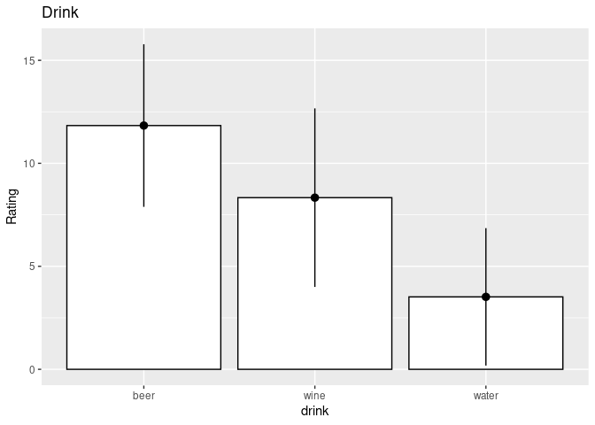

Factorial Repeted Measure Anova
================

``` r
library(ez)
```

    ## Registered S3 methods overwritten by 'lme4':
    ##   method                          from
    ##   cooks.distance.influence.merMod car 
    ##   influence.merMod                car 
    ##   dfbeta.influence.merMod         car 
    ##   dfbetas.influence.merMod        car

``` r
library(nlme)
library(ggplot2)
library(multcomp)
```

    ## Loading required package: mvtnorm

    ## Loading required package: survival

    ## Loading required package: TH.data

    ## Loading required package: MASS

    ## 
    ## Attaching package: 'TH.data'

    ## The following object is masked from 'package:MASS':
    ## 
    ##     geyser

``` r
library(pastecs)
library(WRS)
```

    ## Loading required package: akima

    ## Loading required package: robustbase

    ## 
    ## Attaching package: 'robustbase'

    ## The following object is masked from 'package:survival':
    ## 
    ##     heart

    ## 
    ## Attaching package: 'WRS'

    ## The following object is masked from 'package:robustbase':
    ## 
    ##     hard.rejection

    ## The following object is masked from 'package:MASS':
    ## 
    ##     ltsreg

    ## The following object is masked from 'package:stats':
    ## 
    ##     ecdf

    ## The following object is masked from 'package:grDevices':
    ## 
    ##     bmp

``` r
library(reshape)
library(dplyr)
```

    ## 
    ## Attaching package: 'dplyr'

    ## The following object is masked from 'package:reshape':
    ## 
    ##     rename

    ## The following objects are masked from 'package:WRS':
    ## 
    ##     near, pull

    ## The following objects are masked from 'package:pastecs':
    ## 
    ##     first, last

    ## The following object is masked from 'package:MASS':
    ## 
    ##     select

    ## The following object is masked from 'package:nlme':
    ## 
    ##     collapse

    ## The following objects are masked from 'package:stats':
    ## 
    ##     filter, lag

    ## The following objects are masked from 'package:base':
    ## 
    ##     intersect, setdiff, setequal, union

``` r
df<- read.delim("/home/atrides/Desktop/R/statistics_with_R/13_GLM4_RepeatedMeasuresDesigns/Data_Files/Attitude.dat", header=TRUE)

head(df)
```

    ##   beerpos beerneg beerneut winepos wineneg wineneut waterpos waterneg waterneu
    ## 1       1       6        5      38      -5        4       10      -14       -2
    ## 2      43      30        8      20     -12        4        9      -10      -13
    ## 3      15      15       12      20     -15        6        6      -16        1
    ## 4      40      30       19      28      -4        0       20      -10        2
    ## 5       8      12        8      11      -2        6       27        5       -5
    ## 6      17      17       15      17      -6        6        9       -6      -13
    ##   participant
    ## 1          P1
    ## 2          P2
    ## 3          P3
    ## 4          P4
    ## 5          P5
    ## 6          P6

``` r
df_long<- melt(df, id.vars = "participant", measure.vars = c('beerpos','beerneg','beerneut','winepos',
                                                             'wineneg','wineneut','waterpos','waterneg','waterneu'), 
               variable_name = "drinkWperception")

df_long$drinkWperception<- factor(df_long$drinkWperception)
df_long$participant<- factor(df_long$participant)

df_long$drink<- gl(3, 60, 180, labels=c("beer", "wine", "water"))
df_long$atd<- gl(3, 20, 180, labels=c("pos", "neg", "neu"))
```

``` r
# Bar Chart
bar<- ggplot(df_long, aes(drinkWperception, value, fill=drink))+
  stat_summary(fun=mean, geom = "bar", colour="black")+
  stat_summary(fun.data = mean_cl_normal, geom="pointrange")+
  labs(y="Rating")+
  ggtitle("Drink Perception ")
bar
```

<!-- -->

``` r
# box plot
box<- ggplot(df_long, aes(drinkWperception, value, fill=drink))+
  geom_boxplot()+
  labs(y="Rating" )+
  ggtitle("Drink Perception ")
box
```

<!-- -->

``` r
by(df_long$value,df_long$drinkWperception, stat.desc)
```

    ## df_long$drinkWperception: beerpos
    ##      nbr.val     nbr.null       nbr.na          min          max        range 
    ##   20.0000000    0.0000000    0.0000000    1.0000000   43.0000000   42.0000000 
    ##          sum       median         mean      SE.mean CI.mean.0.95          var 
    ##  421.0000000   18.5000000   21.0500000    2.9086758    6.0879284  169.2078947 
    ##      std.dev     coef.var 
    ##   13.0079935    0.6179569 
    ## ------------------------------------------------------------ 
    ## df_long$drinkWperception: beerneg
    ##      nbr.val     nbr.null       nbr.na          min          max        range 
    ##    20.000000     0.000000     0.000000   -19.000000    30.000000    49.000000 
    ##          sum       median         mean      SE.mean CI.mean.0.95          var 
    ##    89.000000     0.000000     4.450000     3.869227     8.098386   299.418421 
    ##      std.dev     coef.var 
    ##    17.303711     3.888474 
    ## ------------------------------------------------------------ 
    ## df_long$drinkWperception: beerneut
    ##      nbr.val     nbr.null       nbr.na          min          max        range 
    ##    20.000000     1.000000     0.000000   -10.000000    28.000000    38.000000 
    ##          sum       median         mean      SE.mean CI.mean.0.95          var 
    ##   200.000000     8.000000    10.000000     2.302173     4.818503   106.000000 
    ##      std.dev     coef.var 
    ##    10.295630     1.029563 
    ## ------------------------------------------------------------ 
    ## df_long$drinkWperception: winepos
    ##      nbr.val     nbr.null       nbr.na          min          max        range 
    ##   20.0000000    0.0000000    0.0000000   11.0000000   38.0000000   27.0000000 
    ##          sum       median         mean      SE.mean CI.mean.0.95          var 
    ##  507.0000000   25.0000000   25.3500000    1.5066083    3.1533673   45.3973684 
    ##      std.dev     coef.var 
    ##    6.7377569    0.2657892 
    ## ------------------------------------------------------------ 
    ## df_long$drinkWperception: wineneg
    ##      nbr.val     nbr.null       nbr.na          min          max        range 
    ##   20.0000000    0.0000000    0.0000000  -23.0000000   -2.0000000   21.0000000 
    ##          sum       median         mean      SE.mean CI.mean.0.95          var 
    ## -240.0000000  -13.5000000  -12.0000000    1.3822179    2.8930153   38.2105263 
    ##      std.dev     coef.var 
    ##    6.1814664   -0.5151222 
    ## ------------------------------------------------------------ 
    ## df_long$drinkWperception: wineneut
    ##      nbr.val     nbr.null       nbr.na          min          max        range 
    ##   20.0000000    1.0000000    0.0000000    0.0000000   21.0000000   21.0000000 
    ##          sum       median         mean      SE.mean CI.mean.0.95          var 
    ##  233.0000000   12.5000000   11.6500000    1.3959999    2.9218614   38.9763158 
    ##      std.dev     coef.var 
    ##    6.2431015    0.5358885 
    ## ------------------------------------------------------------ 
    ## df_long$drinkWperception: waterpos
    ##      nbr.val     nbr.null       nbr.na          min          max        range 
    ##   20.0000000    0.0000000    0.0000000    6.0000000   33.0000000   27.0000000 
    ##          sum       median         mean      SE.mean CI.mean.0.95          var 
    ##  348.0000000   17.0000000   17.4000000    1.5818044    3.3107547   50.0421053 
    ##      std.dev     coef.var 
    ##    7.0740445    0.4065543 
    ## ------------------------------------------------------------ 
    ## df_long$drinkWperception: waterneg
    ##      nbr.val     nbr.null       nbr.na          min          max        range 
    ##   20.0000000    0.0000000    0.0000000  -20.0000000    5.0000000   25.0000000 
    ##          sum       median         mean      SE.mean CI.mean.0.95          var 
    ## -184.0000000  -10.0000000   -9.2000000    1.5210799    3.1836569   46.2736842 
    ##      std.dev     coef.var 
    ##    6.8024763   -0.7393996 
    ## ------------------------------------------------------------ 
    ## df_long$drinkWperception: waterneu
    ##      nbr.val     nbr.null       nbr.na          min          max        range 
    ##    20.000000     2.000000     0.000000   -13.000000    12.000000    25.000000 
    ##          sum       median         mean      SE.mean CI.mean.0.95          var 
    ##    47.000000     2.500000     2.350000     1.529147     3.200541    46.765789 
    ##      std.dev     coef.var 
    ##     6.838552     2.910022

## Doing Planned Contrasts

``` r
AlcoholvsWater<-c(1, 1, -2)
BeervsWine<-c(-1, 1, 0)
contrasts(df_long$drink)<-cbind(AlcoholvsWater, BeervsWine)


NegativevsOther<-c(1, -2, 1)
PositivevsNeutral<-c(-1, 0, 1)
contrasts(df_long$atd)<-cbind(NegativevsOther, PositivevsNeutral)


attitudeModel<-ezANOVA(data = df_long, dv = .(value), wid = .(participant),
                       within = .(atd, drink), type = 3, detailed = TRUE)
attitudeModel
```

    ## $ANOVA
    ##        Effect DFn DFd       SSn      SSd          F            p p<.05
    ## 1 (Intercept)   1  19 11218.006 1920.106 111.005411 2.255322e-09     *
    ## 2         atd   2  38 21628.678 3352.878 122.564825 2.680197e-17     *
    ## 3       drink   2  38  2092.344 7785.878   5.105981 1.086293e-02     *
    ## 4   atd:drink   4  76  2624.422 2906.689  17.154922 4.589040e-10     *
    ##         ges
    ## 1 0.4126762
    ## 2 0.5753191
    ## 3 0.1158687
    ## 4 0.1411741
    ## 
    ## $`Mauchly's Test for Sphericity`
    ##      Effect         W            p p<.05
    ## 2       atd 0.6621013 2.445230e-02     *
    ## 3     drink 0.2672411 6.952302e-06     *
    ## 4 atd:drink 0.5950440 4.356587e-01      
    ## 
    ## $`Sphericity Corrections`
    ##      Effect       GGe        p[GG] p[GG]<.05       HFe        p[HF] p[HF]<.05
    ## 2       atd 0.7474407 1.757286e-13         * 0.7968420 3.142804e-14         *
    ## 3     drink 0.5771143 2.976868e-02         * 0.5907442 2.881391e-02         *
    ## 4 atd:drink 0.7983979 1.900249e-08         * 0.9785878 6.809640e-10         *

``` r
by(df_long$value, df_long$drink, stat.desc)
```

    ## df_long$drink: beer
    ##      nbr.val     nbr.null       nbr.na          min          max        range 
    ##    60.000000     1.000000     0.000000   -19.000000    43.000000    62.000000 
    ##          sum       median         mean      SE.mean CI.mean.0.95          var 
    ##   710.000000    12.500000    11.833333     1.972576     3.947115   233.463277 
    ##      std.dev     coef.var 
    ##    15.279505     1.291226 
    ## ------------------------------------------------------------ 
    ## df_long$drink: wine
    ##      nbr.val     nbr.null       nbr.na          min          max        range 
    ##    60.000000     1.000000     0.000000   -23.000000    38.000000    61.000000 
    ##          sum       median         mean      SE.mean CI.mean.0.95          var 
    ##   500.000000    12.000000     8.333333     2.166080     4.334316   281.514124 
    ##      std.dev     coef.var 
    ##    16.778383     2.013406 
    ## ------------------------------------------------------------ 
    ## df_long$drink: water
    ##      nbr.val     nbr.null       nbr.na          min          max        range 
    ##    60.000000     2.000000     0.000000   -20.000000    33.000000    53.000000 
    ##          sum       median         mean      SE.mean CI.mean.0.95          var 
    ##   211.000000     3.500000     3.516667     1.666806     3.335272   166.694633 
    ##      std.dev     coef.var 
    ##    12.911028     3.671382

``` r
bar1<- ggplot(df_long, aes(drink, value))+
  stat_summary(fun=mean, geom = "bar", colour="black", fill="white")+
  stat_summary(fun.data = mean_cl_normal, geom="pointrange")+
  labs(y="Rating")+
  ggtitle("Drink")
bar1
```

<!-- -->

``` r
by(df_long$value, df_long$atd, stat.desc)
```

    ## df_long$atd: pos
    ##      nbr.val     nbr.null       nbr.na          min          max        range 
    ##   60.0000000    0.0000000    0.0000000    1.0000000   43.0000000   42.0000000 
    ##          sum       median         mean      SE.mean CI.mean.0.95          var 
    ## 1276.0000000   20.5000000   21.2666667    1.2646579    2.5305747   95.9615819 
    ##      std.dev     coef.var 
    ##    9.7959983    0.4606269 
    ## ------------------------------------------------------------ 
    ## df_long$atd: neg
    ##      nbr.val     nbr.null       nbr.na          min          max        range 
    ##    60.000000     0.000000     0.000000   -23.000000    30.000000    53.000000 
    ##          sum       median         mean      SE.mean CI.mean.0.95          var 
    ##  -335.000000    -9.000000    -5.583333     1.713405     3.428516   176.145480 
    ##      std.dev     coef.var 
    ##    13.271981    -2.377071 
    ## ------------------------------------------------------------ 
    ## df_long$atd: neu
    ##      nbr.val     nbr.null       nbr.na          min          max        range 
    ##    60.000000     4.000000     0.000000   -13.000000    28.000000    41.000000 
    ##          sum       median         mean      SE.mean CI.mean.0.95          var 
    ##   480.000000     7.000000     8.000000     1.143392     2.287922    78.440678 
    ##      std.dev     coef.var 
    ##     8.856674     1.107084

``` r
bar2<- ggplot(df_long, aes(atd, value))+
  stat_summary(fun=mean, geom = "bar", colour="black", fill="white")+
  stat_summary(fun.data = mean_cl_normal, geom="pointrange")+
  labs(y="Rating")+
  ggtitle("Attitude")
bar2
```

<!-- -->

## see the effect of interaction effect

``` r
inter_plot<- ggplot()
q1 <- ggplot() +
  stat_summary(fun=mean, geom="line", data=filter(df_long, atd=="pos"), aes(drink,value, group="beer", colour=atd))+
  stat_summary(fun.data =mean_cl_normal, geom="errorbar", data=filter(df_long,atd=="pos"), aes(drink,value), colour="blue",  width=0.2)
q2 <- ggplot() +
  stat_summary(fun=mean, geom="line", data=filter(df_long,  atd=="neg"), aes(drink,value, group="wine", colour=atd))+
  stat_summary(fun.data =mean_cl_normal, geom="errorbar", data=filter(df_long,atd=="neg"), aes(drink,value), colour="red",  width=0.2)
q3 <- ggplot() +
  stat_summary(fun=mean, geom="line", data=filter(df_long,  atd=="neu"), aes(drink,value, group="water", colour=atd))+
  stat_summary(fun.data =mean_cl_normal, geom="errorbar", data=filter(df_long,atd=="neu"), aes(drink,value), colour="green",  width=0.2)

inter_plot<- inter_plot +q1$layers[[1]]+q1$layers[[2]]+q2$layers[[1]]+q2$layers[[2]]+q3$layers[[1]]+q3$layers[[2]]
inter_plot
```

<!-- -->

``` r
# interaction plot shows there is a significant interaction present 
```

## Post Hoc test

``` r
postHoc1<- pairwise.t.test(df_long$value, df_long$drinkWperception, paired = TRUE, p.adjust.method = "bonferroni")
postHoc1
```

    ## 
    ##  Pairwise comparisons using paired t tests 
    ## 
    ## data:  df_long$value and df_long$drinkWperception 
    ## 
    ##          beerpos beerneg beerneut winepos wineneg wineneut waterpos waterneg
    ## beerneg  0.00217 -       -        -       -       -        -        -       
    ## beerneut 0.01982 1.00000 -        -       -       -        -        -       
    ## winepos  1.00000 0.01105 0.00310  -       -       -        -        -       
    ## wineneg  5.6e-08 0.00265 2.0e-07  1.9e-10 -       -        -        -       
    ## wineneut 0.39905 1.00000 1.00000  2.2e-05 2.3e-07 -        -        -       
    ## waterpos 1.00000 0.47584 1.00000  0.07300 1.3e-09 0.10547  -        -       
    ## waterneg 2.9e-06 0.18860 0.00010  3.2e-10 1.00000 1.1e-07  4.9e-11  -       
    ## waterneu 0.00212 1.00000 0.74838  4.3e-10 0.00041 8.1e-05  9.0e-07  0.00068 
    ## 
    ## P value adjustment method: bonferroni

## Factorial repeated-measures designs as a GLM

``` r
baseline<- lme(value~1, random = ~1|participant/drink/atd , data=df_long, method="ML")
drinkmodel<- update(baseline, .~.+drink+atd+drink:atd)
```

``` r
anova(baseline, drinkmodel)
```

    ##            Model df      AIC      BIC   logLik   Test L.Ratio p-value
    ## baseline       1  5 1503.590 1519.555 -746.795                       
    ## drinkmodel     2 13 1316.512 1358.020 -645.256 1 vs 2 203.078  <.0001

``` r
summary(drinkmodel)
```

    ## Linear mixed-effects model fit by maximum likelihood
    ##  Data: df_long 
    ##        AIC     BIC   logLik
    ##   1316.512 1358.02 -645.256
    ## 
    ## Random effects:
    ##  Formula: ~1 | participant
    ##          (Intercept)
    ## StdDev: 0.0006697281
    ## 
    ##  Formula: ~1 | drink %in% participant
    ##         (Intercept)
    ## StdDev:    6.044293
    ## 
    ##  Formula: ~1 | atd %in% drink %in% participant
    ##         (Intercept)  Residual
    ## StdDev:    7.217317 0.2716338
    ## 
    ## Fixed effects: value ~ drink + atd + drink:atd 
    ##                                              Value Std.Error  DF   t-value
    ## (Intercept)                               7.894444 0.9726190 114  8.116687
    ## drinkAlcoholvsWater                       2.188889 0.6877455  38  3.182702
    ## drinkBeervsWine                          -1.750000 1.1912101  38 -1.469094
    ## atdNegativevsOther                        6.738889 0.3905441 114 17.255127
    ## atdPositivevsNeutral                     -6.633333 0.6764423 114 -9.806207
    ## drinkAlcoholvsWater:atdNegativevsOther    0.190278 0.2761564 114  0.689022
    ## drinkBeervsWine:atdNegativevsOther        3.237500 0.4783169 114  6.768525
    ## drinkAlcoholvsWater:atdPositivevsNeutral  0.445833 0.4783169 114  0.932088
    ## drinkBeervsWine:atdPositivevsNeutral     -0.662500 0.8284692 114 -0.799668
    ##                                          p-value
    ## (Intercept)                               0.0000
    ## drinkAlcoholvsWater                       0.0029
    ## drinkBeervsWine                           0.1500
    ## atdNegativevsOther                        0.0000
    ## atdPositivevsNeutral                      0.0000
    ## drinkAlcoholvsWater:atdNegativevsOther    0.4922
    ## drinkBeervsWine:atdNegativevsOther        0.0000
    ## drinkAlcoholvsWater:atdPositivevsNeutral  0.3533
    ## drinkBeervsWine:atdPositivevsNeutral      0.4256
    ##  Correlation: 
    ##                                          (Intr) drnkAW drnkBW atdNgO atdPsN
    ## drinkAlcoholvsWater                      0                                 
    ## drinkBeervsWine                          0      0                          
    ## atdNegativevsOther                       0      0      0                   
    ## atdPositivevsNeutral                     0      0      0      0            
    ## drinkAlcoholvsWater:atdNegativevsOther   0      0      0      0      0     
    ## drinkBeervsWine:atdNegativevsOther       0      0      0      0      0     
    ## drinkAlcoholvsWater:atdPositivevsNeutral 0      0      0      0      0     
    ## drinkBeervsWine:atdPositivevsNeutral     0      0      0      0      0     
    ##                                          dAW:NO dBW:NO dAW:PN
    ## drinkAlcoholvsWater                                          
    ## drinkBeervsWine                                              
    ## atdNegativevsOther                                           
    ## atdPositivevsNeutral                                         
    ## drinkAlcoholvsWater:atdNegativevsOther                       
    ## drinkBeervsWine:atdNegativevsOther       0                   
    ## drinkAlcoholvsWater:atdPositivevsNeutral 0      0            
    ## drinkBeervsWine:atdPositivevsNeutral     0      0      0     
    ## 
    ## Standardized Within-Group Residuals:
    ##           Min            Q1           Med            Q3           Max 
    ## -0.0840605973 -0.0201988918  0.0007445952  0.0243372187  0.1004435299 
    ## 
    ## Number of Observations: 180
    ## Number of Groups: 
    ##                     participant          drink %in% participant 
    ##                              20                              60 
    ## atd %in% drink %in% participant 
    ##                             180

# Robust factorial repeated-measures ANOVA

# no function for now

## Effect Size

### Getting omega squared was tough enough for one way repeated measure anova

### we will use generalized eta-squared(ges) from ezAnova model

``` r
cat("ges for main effect of attitude: ", 0.5753191)
```

    ## ges for main effect of attitude:  0.5753191

``` r
cat("ges for main effect of drink: ", 0.1158687)
```

    ## ges for main effect of drink:  0.1158687

``` r
cat("ges for interaction effect: ", 0.1411741)
```

    ## ges for interaction effect:  0.1411741

``` r
# effect size for planned contrasts
rcontrast<- function(t, dof){
  r<- sqrt((t^2)/((t^2)+dof))
  cat("r : ", r)
}
```

``` r
rcontrast(3.18, 38) # alcohol vs. water
```

    ## r :  0.458457

``` r
rcontrast(-1.47, 38) # beer vs. wine
```

    ## r :  0.2319613

``` r
rcontrast(17.26, 114) # negative vs. other
```

    ## r :  0.8504345

``` r
rcontrast(-9.81, 114) # positive vs. neutral
```

    ## r :  0.6765741

``` r
rcontrast(0.69, 114) # alcohol vs. water with negative vs. other 
```

    ## r :  0.0644899

``` r
rcontrast(6.77, 114) # beer vs. wine with negative vs. other imagery
```

    ## r :  0.5354952

``` r
rcontrast(0.93, 114) # alcohol vs. water with positive vs. neutral 
```

    ## r :  0.08677393

``` r
rcontrast(-0.80, 114) # beer vs. wine with positive vs. neutral 
```

    ## r :  0.07471743
