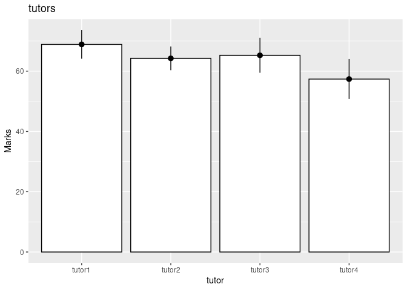

Tutors
================

``` r
library(ez)
```

    ## Registered S3 methods overwritten by 'lme4':
    ##   method                          from
    ##   cooks.distance.influence.merMod car 
    ##   influence.merMod                car 
    ##   dfbeta.influence.merMod         car 
    ##   dfbetas.influence.merMod        car

``` r
library(nlme)
library(ggplot2)
library(multcomp)
```

    ## Loading required package: mvtnorm

    ## Loading required package: survival

    ## Loading required package: TH.data

    ## Loading required package: MASS

    ## 
    ## Attaching package: 'TH.data'

    ## The following object is masked from 'package:MASS':
    ## 
    ##     geyser

``` r
library(pastecs)
library(WRS)
```

    ## Loading required package: akima

    ## Loading required package: robustbase

    ## 
    ## Attaching package: 'robustbase'

    ## The following object is masked from 'package:survival':
    ## 
    ##     heart

    ## 
    ## Attaching package: 'WRS'

    ## The following object is masked from 'package:robustbase':
    ## 
    ##     hard.rejection

    ## The following object is masked from 'package:MASS':
    ## 
    ##     ltsreg

    ## The following object is masked from 'package:stats':
    ## 
    ##     ecdf

    ## The following object is masked from 'package:grDevices':
    ## 
    ##     bmp

``` r
library(reshape)
```

``` r
df<- read.delim("/home/atrides/Desktop/R/statistics_with_R/13_GLM4_RepeatedMeasuresDesigns/Data_Files/TutorMarks.dat")

head(df)
```

    ##   Essay tutor1 tutor2 tutor3 tutor4
    ## 1     1     62     58     63     64
    ## 2     2     63     60     68     65
    ## 3     3     65     61     72     65
    ## 4     4     68     64     58     61
    ## 5     5     69     65     54     59
    ## 6     6     71     67     65     50

``` r
df_long<- melt(df, id.vars = "Essay", measure.vars = c('tutor1', 'tutor2', 'tutor3','tutor4'), variable_name = "tutor")

df_long$Essay<- factor(df_long$Essay)
df_long$tutor<- factor(df_long$tutor)

# Bar Chart
bar<- ggplot(df_long, aes(tutor, value))+
  stat_summary(fun=mean, geom = "bar", colour="black", fill="white")+
  stat_summary(fun.data = mean_cl_normal, geom="pointrange")+
  labs(y="Marks")+
  ggtitle("tutors")
bar
```

<!-- -->

``` r
by(df_long$value, df_long$tutor, stat.desc)
```

    ## df_long$tutor: tutor1
    ##      nbr.val     nbr.null       nbr.na          min          max        range 
    ##   8.00000000   0.00000000   0.00000000  62.00000000  78.00000000  16.00000000 
    ##          sum       median         mean      SE.mean CI.mean.0.95          var 
    ## 551.00000000  68.50000000  68.87500000   1.99497136   4.71735765  31.83928571 
    ##      std.dev     coef.var 
    ##   5.64263110   0.08192568 
    ## ------------------------------------------------------------ 
    ## df_long$tutor: tutor2
    ##      nbr.val     nbr.null       nbr.na          min          max        range 
    ##   8.00000000   0.00000000   0.00000000  58.00000000  73.00000000  15.00000000 
    ##          sum       median         mean      SE.mean CI.mean.0.95          var 
    ## 514.00000000  64.50000000  64.25000000   1.66636902   3.94033660  22.21428571 
    ##      std.dev     coef.var 
    ##   4.71320334   0.07335725 
    ## ------------------------------------------------------------ 
    ## df_long$tutor: tutor3
    ##      nbr.val     nbr.null       nbr.na          min          max        range 
    ##    8.0000000    0.0000000    0.0000000   54.0000000   75.0000000   21.0000000 
    ##          sum       median         mean      SE.mean CI.mean.0.95          var 
    ##  522.0000000   66.0000000   65.2500000    2.4476665    5.7878116   47.9285714 
    ##      std.dev     coef.var 
    ##    6.9230464    0.1061003 
    ## ------------------------------------------------------------ 
    ## df_long$tutor: tutor4
    ##      nbr.val     nbr.null       nbr.na          min          max        range 
    ##    8.0000000    0.0000000    0.0000000   45.0000000   65.0000000   20.0000000 
    ##          sum       median         mean      SE.mean CI.mean.0.95          var 
    ##  459.0000000   60.0000000   57.3750000    2.7962826    6.6121577   62.5535714 
    ##      std.dev     coef.var 
    ##    7.9090816    0.1378489

## Planned Contrasts

``` r
goodVSbad<- c(1,1,1,-3)
firstVS2_3<- c(2,-1,-1,0)
secondVSthird<- c(0,1,-1,0)

contrasts(df_long$tutor)<- cbind(goodVSbad, firstVS2_3, secondVSthird)


# doing normal anova
m01<- ezANOVA(df_long, dv=.(value), wid = .(Essay),within = .(tutor), detailed=TRUE, type = 3)

m01
```

    ## $ANOVA
    ##        Effect DFn DFd        SSn      SSd           F            p p<.05
    ## 1 (Intercept)   1   7 130816.125  103.375 8858.165659 4.027213e-12     *
    ## 2       tutor   3  21    554.125 1048.375    3.699893 2.784621e-02     *
    ##         ges
    ## 1 0.9912725
    ## 2 0.3248333
    ## 
    ## $`Mauchly's Test for Sphericity`
    ##   Effect         W          p p<.05
    ## 2  tutor 0.1310624 0.04305676     *
    ## 
    ## $`Sphericity Corrections`
    ##   Effect       GGe      p[GG] p[GG]<.05       HFe      p[HF] p[HF]<.05
    ## 2  tutor 0.5576185 0.06287878           0.7122543 0.04712856         *

## PostHoc test

``` r
pairwise.t.test(df_long$value, df_long$tutor, paired = TRUE, p.adjust.method = "bonferroni")
```

    ## 
    ##  Pairwise comparisons using paired t tests 
    ## 
    ## data:  df_long$value and df_long$tutor 
    ## 
    ##        tutor1 tutor2 tutor3
    ## tutor2 0.022  -      -     
    ## tutor3 1.000  1.000  -     
    ## tutor4 0.261  0.961  0.637 
    ## 
    ## P value adjustment method: bonferroni

``` r
# the conclusion drawn by post hoc tests are somwhat wrong , due to violation of sphericity assumption
```

``` r
cor(df[, cbind('tutor1', 'tutor2', 'tutor3', 'tutor4')])
```

    ##            tutor1     tutor2     tutor3     tutor4
    ## tutor1  1.0000000  0.8393134  0.1947344 -0.9014994
    ## tutor2  0.8393134  1.0000000  0.2692549 -0.9187944
    ## tutor3  0.1947344  0.2692549  1.0000000 -0.3098220
    ## tutor4 -0.9014994 -0.9187944 -0.3098220  1.0000000

## Using multilevel model, better approach

``` r
baseline<- lme(value~1, data=df_long, random = ~1|Essay/tutor, method = "ML")
tutormodel<- lme(value~1+tutor, data=df_long, random = ~1|Essay/tutor, method = "ML")

anova(baseline, tutormodel)
```

    ##            Model df      AIC      BIC    logLik   Test  L.Ratio p-value
    ## baseline       1  4 226.0472 231.9101 -109.0236                        
    ## tutormodel     2  7 219.4777 229.7379 -102.7389 1 vs 2 12.56946  0.0057

``` r
summary(tutormodel)
```

    ## Linear mixed-effects model fit by maximum likelihood
    ##  Data: df_long 
    ##        AIC      BIC    logLik
    ##   219.4777 229.7379 -102.7389
    ## 
    ## Random effects:
    ##  Formula: ~1 | Essay
    ##          (Intercept)
    ## StdDev: 0.0001962738
    ## 
    ##  Formula: ~1 | tutor %in% Essay
    ##         (Intercept)   Residual
    ## StdDev:    5.999271 0.03051291
    ## 
    ## Fixed effects: value ~ 1 + tutor 
    ##                      Value Std.Error DF  t-value p-value
    ## (Intercept)        63.9375 1.1337704 21 56.39369  0.0000
    ## tutorgoodVSbad      2.1875 0.6545826 21  3.34182  0.0031
    ## tutorfirstVS2_3     1.3750 0.9257196 21  1.48533  0.1523
    ## tutorsecondVSthird -0.5000 1.6033934 21 -0.31184  0.7582
    ##  Correlation: 
    ##                    (Intr) ttrgVS tVS2_3
    ## tutorgoodVSbad     0                   
    ## tutorfirstVS2_3    0      0            
    ## tutorsecondVSthird 0      0      0     
    ## 
    ## Standardized Within-Group Residuals:
    ##           Min            Q1           Med            Q3           Max 
    ## -0.0104910907 -0.0039474053  0.0003708972  0.0036030008  0.0082657078 
    ## 
    ## Number of Observations: 32
    ## Number of Groups: 
    ##            Essay tutor %in% Essay 
    ##                8               32

``` r
postHoc2<- glht(tutormodel, linfct=mcp(tutor="Tukey"))
summary(postHoc2)
```

    ## 
    ##   Simultaneous Tests for General Linear Hypotheses
    ## 
    ## Multiple Comparisons of Means: Tukey Contrasts
    ## 
    ## 
    ## Fit: lme.formula(fixed = value ~ 1 + tutor, data = df_long, random = ~1 | 
    ##     Essay/tutor, method = "ML")
    ## 
    ## Linear Hypotheses:
    ##                      Estimate Std. Error z value Pr(>|z|)    
    ## tutor2 - tutor1 == 0   -4.625      3.000  -1.542   0.4124    
    ## tutor3 - tutor1 == 0   -3.625      3.000  -1.208   0.6214    
    ## tutor4 - tutor1 == 0  -11.500      3.000  -3.834   <0.001 ***
    ## tutor3 - tutor2 == 0    1.000      3.000   0.333   0.9872    
    ## tutor4 - tutor2 == 0   -6.875      3.000  -2.292   0.1000    
    ## tutor4 - tutor3 == 0   -7.875      3.000  -2.625   0.0428 *  
    ## ---
    ## Signif. codes:  0 '***' 0.001 '**' 0.01 '*' 0.05 '.' 0.1 ' ' 1
    ## (Adjusted p values reported -- single-step method)

``` r
confint(postHoc2)
```

    ## 
    ##   Simultaneous Confidence Intervals
    ## 
    ## Multiple Comparisons of Means: Tukey Contrasts
    ## 
    ## 
    ## Fit: lme.formula(fixed = value ~ 1 + tutor, data = df_long, random = ~1 | 
    ##     Essay/tutor, method = "ML")
    ## 
    ## Quantile = 2.5678
    ## 95% family-wise confidence level
    ##  
    ## 
    ## Linear Hypotheses:
    ##                      Estimate lwr      upr     
    ## tutor2 - tutor1 == 0  -4.6250 -12.3275   3.0775
    ## tutor3 - tutor1 == 0  -3.6250 -11.3275   4.0775
    ## tutor4 - tutor1 == 0 -11.5000 -19.2025  -3.7975
    ## tutor3 - tutor2 == 0   1.0000  -6.7025   8.7025
    ## tutor4 - tutor2 == 0  -6.8750 -14.5775   0.8275
    ## tutor4 - tutor3 == 0  -7.8750 -15.5775  -0.1725

## Effect Sizes

## getting effect size of various contrasts used in our model

``` r
rcontrast<- function(t, dof){
  eff<- sqrt(t^2/((t^2)+dof))
  cat("r contrast: ", eff)
}

rcontrast(3.34182, 21)
```

    ## r contrast:  0.5892134

``` r
rcontrast(1.48533,21)
```

    ## r contrast:  0.3083336

``` r
rcontrast(-0.31184,21)
```

    ## r contrast:  0.06789206

## Robust anova

``` r
df<- df[, -c(1)]
rmanova(df)
```

    ## [1] "The number of groups to be compared is"
    ## [1] 4

    ## $test
    ## [1] 2.348734
    ## 
    ## $df
    ## [1] 1.994226 9.971132
    ## 
    ## $siglevel
    ## [1] 0.1460211
    ## 
    ## $tmeans
    ## [1] 68.50000 63.83333 65.50000 58.16667
    ## 
    ## $ehat
    ## [1] 0.5322935
    ## 
    ## $etil
    ## [1] 0.6647422

``` r
rmanovab(df, nboot = 2000)
```

    ## [1] "Taking bootstrap samples. Please wait."

    ## Warning in cor(xvec, yvec): the standard deviation is zero
    
    ## Warning in cor(xvec, yvec): the standard deviation is zero
    
    ## Warning in cor(xvec, yvec): the standard deviation is zero
    
    ## Warning in cor(xvec, yvec): the standard deviation is zero
    
    ## Warning in cor(xvec, yvec): the standard deviation is zero
    
    ## Warning in cor(xvec, yvec): the standard deviation is zero
    
    ## Warning in cor(xvec, yvec): the standard deviation is zero
    
    ## Warning in cor(xvec, yvec): the standard deviation is zero
    
    ## Warning in cor(xvec, yvec): the standard deviation is zero
    
    ## Warning in cor(xvec, yvec): the standard deviation is zero
    
    ## Warning in cor(xvec, yvec): the standard deviation is zero
    
    ## Warning in cor(xvec, yvec): the standard deviation is zero
    
    ## Warning in cor(xvec, yvec): the standard deviation is zero
    
    ## Warning in cor(xvec, yvec): the standard deviation is zero
    
    ## Warning in cor(xvec, yvec): the standard deviation is zero
    
    ## Warning in cor(xvec, yvec): the standard deviation is zero
    
    ## Warning in cor(xvec, yvec): the standard deviation is zero
    
    ## Warning in cor(xvec, yvec): the standard deviation is zero
    
    ## Warning in cor(xvec, yvec): the standard deviation is zero
    
    ## Warning in cor(xvec, yvec): the standard deviation is zero
    
    ## Warning in cor(xvec, yvec): the standard deviation is zero
    
    ## Warning in cor(xvec, yvec): the standard deviation is zero
    
    ## Warning in cor(xvec, yvec): the standard deviation is zero
    
    ## Warning in cor(xvec, yvec): the standard deviation is zero

    ## [1] "The number of groups to be compared is"
    ## [1] 4

    ## $teststat
    ## [1] 2.348734
    ## 
    ## $crit
    ## [1] 6.478475

``` r
rmmcp(df)
```

    ## $n
    ## [1] 8
    ## 
    ## $test
    ##      Group Group       test      p.value  p.crit        se
    ## [1,]     1     2 14.0532321 3.282054e-05 0.00851 0.2727724
    ## [2,]     1     3  0.8549393 4.316329e-01 0.02500 4.0938579
    ## [3,]     1     4  1.4101496 2.175644e-01 0.01020 7.5642093
    ## [4,]     2     3 -0.4022510 7.041190e-01 0.05000 3.3146800
    ## [5,]     2     4  0.9388455 3.909130e-01 0.01690 5.8582588
    ## [6,]     3     4  1.2214564 2.763582e-01 0.01270 5.1850671
    ## 
    ## $psihat
    ##      Group Group    psihat   ci.lower  ci.upper
    ## [1,]     1     2  3.833333   2.682422  4.984244
    ## [2,]     1     3  3.500000 -13.773252 20.773252
    ## [3,]     1     4 10.666667 -21.249070 42.582404
    ## [4,]     2     3 -1.333333 -15.318993 12.652326
    ## [5,]     2     4  5.500000 -19.217805 30.217805
    ## [6,]     3     4  6.333333 -15.544067 28.210734
    ## 
    ## $con
    ##      [,1]
    ## [1,]    0
    ## 
    ## $num.sig
    ## [1] 1

``` r
pairdepb(df, nboot = 2000)
```

    ## [1] "Taking bootstrap samples. Please wait."

    ## Warning in cor(xvec, yvec): the standard deviation is zero
    
    ## Warning in cor(xvec, yvec): the standard deviation is zero
    
    ## Warning in cor(xvec, yvec): the standard deviation is zero
    
    ## Warning in cor(xvec, yvec): the standard deviation is zero
    
    ## Warning in cor(xvec, yvec): the standard deviation is zero
    
    ## Warning in cor(xvec, yvec): the standard deviation is zero
    
    ## Warning in cor(xvec, yvec): the standard deviation is zero
    
    ## Warning in cor(xvec, yvec): the standard deviation is zero
    
    ## Warning in cor(xvec, yvec): the standard deviation is zero
    
    ## Warning in cor(xvec, yvec): the standard deviation is zero
    
    ## Warning in cor(xvec, yvec): the standard deviation is zero
    
    ## Warning in cor(xvec, yvec): the standard deviation is zero
    
    ## Warning in cor(xvec, yvec): the standard deviation is zero
    
    ## Warning in cor(xvec, yvec): the standard deviation is zero
    
    ## Warning in cor(xvec, yvec): the standard deviation is zero
    
    ## Warning in cor(xvec, yvec): the standard deviation is zero
    
    ## Warning in cor(xvec, yvec): the standard deviation is zero
    
    ## Warning in cor(xvec, yvec): the standard deviation is zero

    ## $test
    ##      Group Group       test       se
    ## [1,]     1     2  4.2092178 1.108678
    ## [2,]     1     3  0.9192771 3.263434
    ## [3,]     1     4  1.8441848 5.603198
    ## [4,]     2     3 -0.5380311 3.097714
    ## [5,]     2     4  1.1977475 4.731103
    ## [6,]     3     4  1.5978885 4.589390
    ## 
    ## $psihat
    ##      Group Group    psihat ci.lower ci.upper
    ## [1,]     1     2  4.666667     -Inf      Inf
    ## [2,]     1     3  3.000000     -Inf      Inf
    ## [3,]     1     4 10.333333     -Inf      Inf
    ## [4,]     2     3 -1.666667     -Inf      Inf
    ## [5,]     2     4  5.666667     -Inf      Inf
    ## [6,]     3     4  7.333333     -Inf      Inf
    ## 
    ## $crit
    ## [1] Inf
