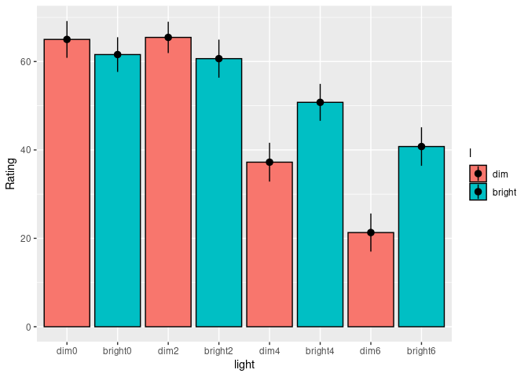
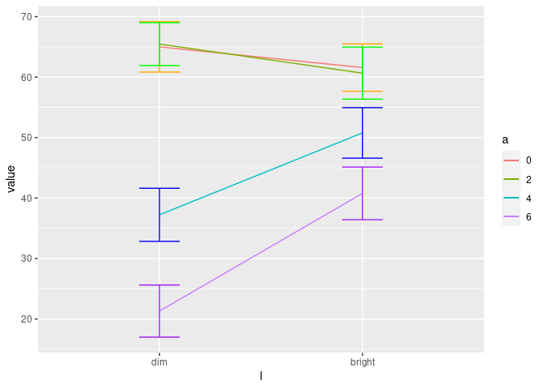

Beer Goggles
================

``` r
library(ez)
```

    ## Registered S3 methods overwritten by 'lme4':
    ##   method                          from
    ##   cooks.distance.influence.merMod car 
    ##   influence.merMod                car 
    ##   dfbeta.influence.merMod         car 
    ##   dfbetas.influence.merMod        car

``` r
library(nlme)
library(ggplot2)
library(multcomp)
```

    ## Loading required package: mvtnorm

    ## Loading required package: survival

    ## Loading required package: TH.data

    ## Loading required package: MASS

    ## 
    ## Attaching package: 'TH.data'

    ## The following object is masked from 'package:MASS':
    ## 
    ##     geyser

``` r
library(pastecs)
library(WRS)
```

    ## Loading required package: akima

    ## Loading required package: robustbase

    ## 
    ## Attaching package: 'robustbase'

    ## The following object is masked from 'package:survival':
    ## 
    ##     heart

    ## 
    ## Attaching package: 'WRS'

    ## The following object is masked from 'package:robustbase':
    ## 
    ##     hard.rejection

    ## The following object is masked from 'package:MASS':
    ## 
    ##     ltsreg

    ## The following object is masked from 'package:stats':
    ## 
    ##     ecdf

    ## The following object is masked from 'package:grDevices':
    ## 
    ##     bmp

``` r
library(reshape)
library(dplyr)
```

    ## 
    ## Attaching package: 'dplyr'

    ## The following object is masked from 'package:reshape':
    ## 
    ##     rename

    ## The following objects are masked from 'package:WRS':
    ## 
    ##     near, pull

    ## The following objects are masked from 'package:pastecs':
    ## 
    ##     first, last

    ## The following object is masked from 'package:MASS':
    ## 
    ##     select

    ## The following object is masked from 'package:nlme':
    ## 
    ##     collapse

    ## The following objects are masked from 'package:stats':
    ## 
    ##     filter, lag

    ## The following objects are masked from 'package:base':
    ## 
    ##     intersect, setdiff, setequal, union

``` r
df<- read.delim("/home/atrides/Desktop/R/statistics_with_R/13_GLM4_RepeatedMeasuresDesigns/Data_Files/BeerGogglesLighting.dat")

df_long<- melt(df, id.vars = 'Participant', measure.vars = c("dim0",'bright0', 'dim2','bright2','dim4', 
                                                             'bright4', 'dim6','bright6' ), 
               variable_name = "light")

df_long$light<- factor(df_long$light)
df_long$Participant<- factor(df_long$Participant)

df_long$l<- gl(2, 26, 208, labels = c('dim', 'bright'))
df_long$a<- gl(4, 52, 208, labels = c(0,2,4,6))

head(df_long)
```

    ##   Participant light value   l a
    ## 1           1  dim0    58 dim 0
    ## 2           2  dim0    67 dim 0
    ## 3           3  dim0    64 dim 0
    ## 4           4  dim0    63 dim 0
    ## 5           5  dim0    48 dim 0
    ## 6           6  dim0    49 dim 0

``` r
# Bar Chart
bar<- ggplot(df_long, aes(light, value, fill=l))+
  stat_summary(fun=mean, geom = "bar", colour="black")+
  stat_summary(fun.data = mean_cl_normal, geom="pointrange")+
  labs(y="Rating")
bar
```

<!-- -->

``` r
# see the effect of interaction effect
inter_plot<- ggplot()
q1 <- ggplot() +
  stat_summary(fun=mean, geom="line", data=filter(df_long, a==0), aes(l,value, group=1, colour=a))+
  stat_summary(fun.data =mean_cl_normal, geom="errorbar", data=filter(df_long,a==0), aes(l,value),colour='orange',  width=0.2)
q2 <- ggplot() +
  stat_summary(fun=mean, geom="line", data=filter(df_long, a==2), aes(l,value, group=2, colour=a))+
  stat_summary(fun.data =mean_cl_normal, geom="errorbar", data=filter(df_long,a==2), aes(l,value),colour='green',  width=0.2)
q3 <- ggplot() +
  stat_summary(fun=mean, geom="line", data=filter(df_long, a==4), aes(l,value, group=3, colour=a))+
  stat_summary(fun.data =mean_cl_normal, geom="errorbar", data=filter(df_long,a==4), aes(l,value), colour="blue", width=0.2)
q4 <- ggplot() +
  stat_summary(fun=mean, geom="line", data=filter(df_long, a==6), aes(l,value, group=4, colour=a))+
  stat_summary(fun.data =mean_cl_normal, geom="errorbar", data=filter(df_long,a==6), aes(l,value),colour="purple",  width=0.2)

inter_plot<- inter_plot +q1$layers[[1]]+q1$layers[[2]]+q2$layers[[1]]+q2$layers[[2]]+
  q3$layers[[1]]+q3$layers[[2]]+q4$layers[[1]]+q4$layers[[2]]
inter_plot
```

<!-- -->

``` r
# interaction seems to be significant
```

## setting contrasts

``` r
NonevsAlcohol<-c(4, -1, -1, -1) 
MaxvsLess<-c(0, -1, -1, 2) 
TwovsFour<-c(0, 1, -1,0) 
DimvsLight<-c(1, -1) 

contrasts(df_long$a)<- cbind(NonevsAlcohol,MaxvsLess,  TwovsFour)
contrasts(df_long$l)<- cbind(DimvsLight)

ezModel<- ezANOVA(df_long, dv=.(value), wid=.(Participant), within = .(a,l), type = 3, detailed = TRUE)
ezModel
```

    ## $ANOVA
    ##        Effect DFn DFd        SSn      SSd          F            p p<.05
    ## 1 (Intercept)   1  25 527224.923 3281.827 4016.24564 3.914580e-29     *
    ## 2           a   3  75  38591.654 9242.596  104.38532 1.060621e-26     *
    ## 3           l   1  25   1993.923 2128.327   23.42125 5.646965e-05     *
    ## 4         a:l   3  75   5765.423 6487.327   22.21802 2.137948e-10     *
    ##          ges
    ## 1 0.96144889
    ## 2 0.64608297
    ## 3 0.08619016
    ## 4 0.21428418
    ## 
    ## $`Mauchly's Test for Sphericity`
    ##   Effect         W         p p<.05
    ## 2      a 0.8202794 0.4540004      
    ## 4    a:l 0.8978273 0.7681234      
    ## 
    ## $`Sphericity Corrections`
    ##   Effect       GGe        p[GG] p[GG]<.05       HFe        p[HF] p[HF]<.05
    ## 2      a 0.8729063 1.320765e-23         * 0.9842555 2.563576e-26         *
    ## 4    a:l 0.9364231 7.176503e-10         * 1.0671273 2.137948e-10         *

``` r
# Since l variable has 2 levels only, no prblm of sphericity
# also , from output, no violation of sphericity
```

## post hoc tests

``` r
pairwise.t.test(df_long$value, df_long$light, paired = TRUE, p.adjust.method = 'bonferroni')
```

    ## 
    ##  Pairwise comparisons using paired t tests 
    ## 
    ## data:  df_long$value and df_long$light 
    ## 
    ##         dim0    bright0 dim2    bright2 dim4    bright4 dim6   
    ## bright0 1.00000 -       -       -       -       -       -      
    ## dim2    1.00000 1.00000 -       -       -       -       -      
    ## bright2 1.00000 1.00000 1.00000 -       -       -       -      
    ## dim4    9.6e-07 2.3e-07 4.8e-12 1.3e-08 -       -       -      
    ## bright4 0.01005 0.02855 0.00059 0.20570 0.00060 -       -      
    ## dim6    1.1e-13 6.0e-12 9.3e-13 1.3e-11 0.00235 3.3e-08 -      
    ## bright6 2.4e-07 2.1e-07 1.0e-08 2.7e-08 1.00000 0.06173 2.3e-06
    ## 
    ## P value adjustment method: bonferroni

``` r
# Using multilevel models
baseline<- lme(value~1,random = ~1|Participant/a/l, method="ML", data=df_long)
m02<- update(baseline, .~.+a+l+a:l)
anova(baseline, m02)
```

    ##          Model df      AIC      BIC    logLik   Test  L.Ratio p-value
    ## baseline     1  5 1770.963 1787.651 -880.4816                        
    ## m02          2 12 1571.870 1611.920 -773.9350 1 vs 2 213.0931  <.0001

``` r
summary(m02)
```

    ## Linear mixed-effects model fit by maximum likelihood
    ##  Data: df_long 
    ##       AIC      BIC   logLik
    ##   1571.87 1611.921 -773.935
    ## 
    ## Random effects:
    ##  Formula: ~1 | Participant
    ##         (Intercept)
    ## StdDev:   0.9829406
    ## 
    ##  Formula: ~1 | a %in% Participant
    ##         (Intercept)
    ## StdDev:    4.222085
    ## 
    ##  Formula: ~1 | l %in% a %in% Participant
    ##         (Intercept) Residual
    ## StdDev:    8.784353 2.382847
    ## 
    ## Fixed effects: value ~ a + l + a:l 
    ##                               Value Std.Error  DF   t-value p-value
    ## (Intercept)                49.48333 0.7993877 100  61.90155       0
    ## aNonevsAlcohol              3.45128 0.3555200  75   9.70770       0
    ## aMaxvsLess                 -7.49679 0.6284765  75 -11.92852       0
    ## aTwovsFour                  9.52885 1.0885533  75   8.75368       0
    ## lDimvsLight                -3.41667 0.6478711 100  -5.27368       0
    ## aNonevsAlcohol:lDimvsLight  1.28205 0.2972636 100   4.31284       0
    ## aMaxvsLess:lDimvsLight     -2.51603 0.5254928 100  -4.78794       0
    ## aTwovsFour:lDimvsLight      4.58654 0.9101803 100   5.03915       0
    ##  Correlation: 
    ##                            (Intr) aNnvsA aMxvsL aTwvsF lDmvsL aNA:DL aML:DL
    ## aNonevsAlcohol             -0.111                                          
    ## aMaxvsLess                  0.000  0.000                                   
    ## aTwovsFour                  0.000  0.000  0.000                            
    ## lDimvsLight                 0.000  0.000  0.000  0.000                     
    ## aNonevsAlcohol:lDimvsLight  0.000  0.000  0.000  0.000 -0.115              
    ## aMaxvsLess:lDimvsLight      0.000  0.000  0.000  0.000  0.000  0.000       
    ## aTwovsFour:lDimvsLight      0.000  0.000  0.000  0.000  0.000  0.000  0.000
    ## 
    ## Standardized Within-Group Residuals:
    ##         Min          Q1         Med          Q3         Max 
    ## -0.71573137 -0.17532483 -0.01052786  0.15906002  0.54895940 
    ## 
    ## Number of Observations: 208
    ## Number of Groups: 
    ##               Participant        a %in% Participant l %in% a %in% Participant 
    ##                        26                       104                       208

``` r
# Effect Sizes
# getting effect size of various contrasts used in our model
rcontrast<- function(t, dof){
  eff<- sqrt(t^2/((t^2)+dof))
  cat("r contrast: ", eff)
}

rcontrast( 10.21387, 75) 
```

    ## r contrast:  0.7627323

``` r
rcontrast(-12.22235, 75) 
```

    ## r contrast:  0.8159377

``` r
rcontrast(9.94787, 75) 
```

    ## r contrast:  0.7542325

``` r
rcontrast(5.27368, 100) 
```

    ## r contrast:  0.4664751

``` r
rcontrast(-4.31284, 100) 
```

    ## r contrast:  0.3960226

``` r
rcontrast(4.78794, 100) 
```

    ## r contrast:  0.4318468

``` r
rcontrast(-5.03915, 100)
```

    ## r contrast:  0.4500084
